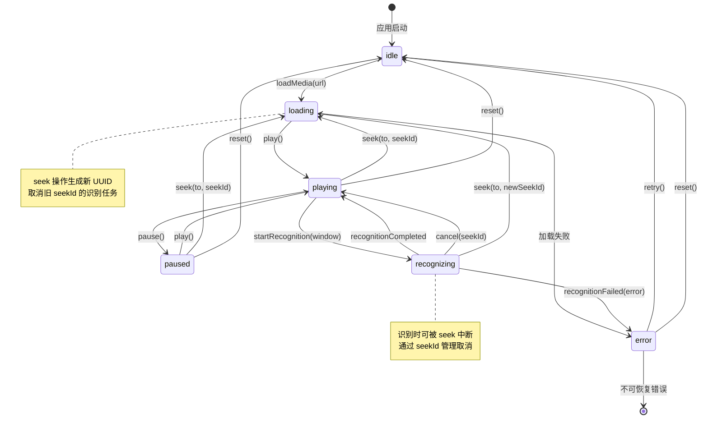

# 播放器与识别状态机

## 状态转移图



## 状态说明

### idle（空闲）
- **描述**：未加载任何媒体
- **可转移到**：loading
- **触发事件**：loadMedia(URL)

### loading（加载中）
- **描述**：正在加载媒体文件
- **关联数据**：mediaURL (URL)
- **可转移到**：playing, error
- **触发事件**：play(), 加载失败

### playing（播放中）
- **描述**：正在播放媒体
- **关联数据**：progress (TimeInterval)
- **可转移到**：paused, recognizing, loading, idle
- **触发事件**：pause(), startRecognition(), seek(), reset()
- **定时更新**：progressUpdate(TimeInterval) 更新关联数据

### paused（暂停）
- **描述**：播放已暂停
- **关联数据**：at (TimeInterval) - 暂停时的播放位置
- **可转移到**：playing, loading, idle
- **触发事件**：play(), seek(), reset()

### recognizing（识别中）
- **描述**：正在进行语音识别
- **关联数据**：
  - window (TimeRange) - 识别的时间窗口
  - seekId (UUID?) - 关联的 seek 操作 ID
- **可转移到**：playing, loading, error
- **触发事件**：recognitionCompleted, cancel(seekId), seek(), recognitionFailed()
- **并发处理**：seek 事件优先级最高，立即中断识别

### error（错误）
- **描述**：系统发生错误
- **关联数据**：
  - error (PlayerError) - 错误详情
  - recoverable (Bool) - 是否可恢复
- **可转移到**：idle（如果可恢复）, [终态]（如果不可恢复）
- **触发事件**：retry(), reset()

## 事件说明

### 媒体控制事件

#### loadMedia(URL)
- **触发状态**：idle
- **目标状态**：loading
- **副作用**：开始加载媒体资源

#### play()
- **触发状态**：loading, paused
- **目标状态**：playing
- **副作用**：启动播放器

#### pause()
- **触发状态**：playing
- **目标状态**：paused
- **副作用**：暂停播放器，保存当前位置

#### seek(to: TimeInterval, seekId: UUID)
- **触发状态**：playing, paused, recognizing
- **目标状态**：loading
- **副作用**：
  - 生成新 seekId
  - 取消旧 seekId 关联的识别任务
  - 跳转到目标时间

#### progressUpdate(TimeInterval)
- **触发状态**：playing
- **目标状态**：playing（更新关联数据）
- **触发频率**：每 0.1 秒（由 PlayerService 定时发送）

### 识别控制事件

#### startRecognition(TimeRange)
- **触发状态**：playing
- **目标状态**：recognizing
- **副作用**：启动 ASR 识别任务

#### recognitionCompleted
- **触发状态**：recognizing
- **目标状态**：playing
- **副作用**：保存识别结果到 SubtitleStore

#### recognitionFailed(Error)
- **触发状态**：recognizing
- **目标状态**：error
- **副作用**：记录错误日志

### 取消事件

#### cancel(seekId: UUID?)
- **触发状态**：recognizing
- **目标状态**：playing
- **副作用**：
  - 如果 seekId 匹配，取消当前识别任务
  - 如果 seekId 为 nil，取消所有识别任务

### 错误恢复事件

#### retry()
- **触发状态**：error（recoverable=true）
- **目标状态**：idle
- **副作用**：清理错误状态

#### reset()
- **触发状态**：任意状态
- **目标状态**：idle
- **副作用**：停止所有任务，释放资源

## 并发冲突处理

### 快速 seek 场景

```
时间线：
t0: playing(progress=10s)
t1: seek(to=30s, seekId=A) → loading
t2: startRecognition([30-45]s) → recognizing(seekId=A)
t3: seek(to=60s, seekId=B) → 取消 seekId=A, 转 loading
t4: startRecognition([60-75]s) → recognizing(seekId=B)
```

**关键机制**：
1. 每次 seek 生成新 UUID（seekId）
2. recognizing 状态记录关联的 seekId
3. 新 seek 到来时，取消旧 seekId 的所有任务
4. 使用幂等取消：同一 seekId 多次取消仅处理一次

### 状态不一致检测

定时心跳（每 1s）检测：
- PlayerStateMachine.currentState
- AVPlayer.timeControlStatus

如果不一致：
1. 记录 Warning 日志
2. 强制同步到 AVPlayer 真实状态
3. 发送 inconsistentState 事件（可选）

## 性能约束

- 状态转移耗时 P99 < 50ms（不含异步任务）
- seekId 取消延迟 P95 < 500ms（高端设备）
- 快速 seek（100 次连续）无死锁/崩溃
- 内存使用：状态机本身 < 1MB

## 测试覆盖

### 正常路径（8 个用例）
- [x] idle → loading → playing
- [x] playing → paused → playing
- [x] playing → recognizing → playing
- [x] playing → loading → playing (seek)
- [x] idle → loading → error
- [x] recognizing → playing (cancel)
- [x] paused → loading → playing
- [x] error → idle (retry)

### 边界测试（6 个用例）
- [x] 快速 seek（100 次连续）
- [x] 并发识别触发
- [x] seekId 幂等取消
- [x] loading 超时
- [x] 非法转移拦截
- [x] 错误恢复

### 并发安全（2 个用例）
- [x] 多线程事件发送
- [x] 多订阅者观察

---

**文档版本**：v1.0  
**创建日期**：2025-11-07  
**对应任务**：Task-104 PR1
