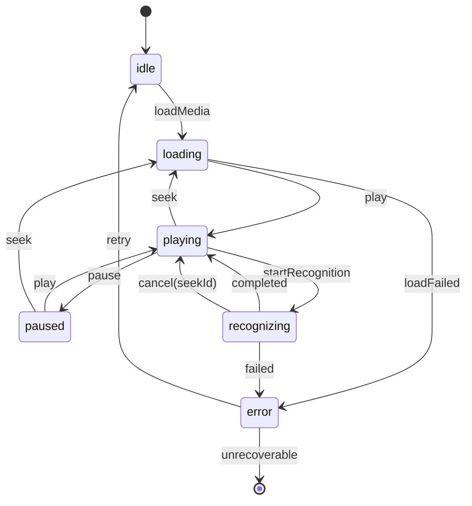

# Task 详细设计：Task-104 播放器与识别状态机设计与实现

- Sprint：S1
- Task：Task-104 播放器与识别状态机设计与实现
- PBI：PRD §6.4/§6.5（状态与同步）
- Owner：@架构
- 状态：In Progress
- 开始日期：2025-11-07
- 平台优先级：macOS（优先实现，便于测试）→ iOS

## 相关 TDD
- [x] docs/tdd/iOS-macOS/hld-ios-macos-v0.2.md — 参见 §2.2 并发与调度、§11 UI 与 ViewModel 合同

## 相关 ADR
- [ ] docs/adr/iOS-macOS/0007-dual-asr-backend-strategy.md（待创建）— whisper.cpp vs MLX Swift 并发模型与取消语义差异
- [x] docs/adr/iOS-macOS/0005-testing-di-strategy.md — DI 策略影响状态机测试设计

## 1. 目标与范围
- 目标（量化）：实现 idle/loading/playing/paused/recognizing/error 状态机；快速 seek 冲突可控，100 次连续 seek 无死锁/崩溃；状态转移用例覆盖率 ≥ 90%。
- 范围/非目标：本任务不实现 UI 细节与样式；仅提供 Actor 封装与事件处理、取消机制及测试。

## 2. 方案要点（引用为主）

### 2.1 核心设计
- 遵循 HLD §2.2 的并发与调度原则，以 Actor 作为并发边界；通过 seekId（UUID）实现幂等取消。
- **状态机定义**（本任务首次明确定义，完成后将反向更新 HLD）：

#### 状态枚举
```swift
public enum PlayerRecognitionState: Equatable {
    case idle
    case loading(mediaURL: URL)
    case playing(progress: TimeInterval)
    case paused(at: TimeInterval)
    case recognizing(window: TimeRange, seekId: UUID?)
    case error(PlayerError, recoverable: Bool)
}
```

#### 事件枚举
```swift
public enum PlayerEvent {
    case loadMedia(URL)
    case play
    case pause
    case seek(to: TimeInterval, seekId: UUID)
    case startRecognition(TimeRange)
    case recognitionCompleted
    case recognitionFailed(Error)
    case cancel(seekId: UUID)
}
```

#### 状态转移规则


#### 并发冲突处理
- **快速 seek 策略**：每次 seek 生成新 UUID，取消旧 seekId 的所有识别任务
- **幂等取消**：同一 seekId 多次取消仅处理一次，避免重复资源释放
- **状态一致性**：所有状态转移在单一 Actor 内顺序执行，避免竞态

### 2.2 与 TDD 差异
- **偏差内容**：HLD §2.2 当前仅定义并发调度框架，未明确播放器状态机的具体状态与转移规则
- **原因**：状态机设计需要与 PlayerService、AsrEngine 接口联合确定，属于实施阶段细化
- **影响**：无其他模块依赖，本任务作为设计首创
- **后续**：✅ 需要在任务完成后更新 HLD §11，补充 PlayerViewModel 状态机详细定义

## 3. 改动清单

### 新增文件
- PrismCore/Sources/StateMachine/PlayerRecognitionState.swift — 状态与事件枚举
- PrismCore/Sources/StateMachine/PlayerStateMachine.swift — Actor 状态机实现
- PrismCore/Sources/Coordinators/PlaybackCoordinator.swift — 播放与识别协调器
- PrismCore/Tests/StateMachine/PlayerStateMachineTests.swift — 状态转移测试

### 接口定义
```swift
/// 状态机协议（Actor 保证线程安全）
public protocol StateMachine: Actor {
    associatedtype State
    associatedtype Event
    
    /// 当前状态流（AsyncStream 观察者模式）
    var statePublisher: AsyncStream<State> { get }
    
    /// 发送事件，触发状态转移
    /// - Throws: StateMachineError（非法转移、内部错误）
    func send(_ event: Event) async throws
    
    /// 当前状态快照（仅用于调试/测试）
    var currentState: State { get async }
}

/// 播放器状态机具体实现
public actor PlayerStateMachine: StateMachine {
    public typealias State = PlayerRecognitionState
    public typealias Event = PlayerEvent
    
    // 实现细节见 PR2
}
```

### 数据结构
```swift
/// 时间范围（用于识别窗口）
public struct TimeRange: Equatable {
    let start: TimeInterval
    let end: TimeInterval
}

/// 播放器错误
public enum PlayerError: Error, Equatable {
    case mediaLoadFailed(URL, underlying: String)
    case recognitionFailed(TimeRange, underlying: String)
    case seekFailed(TimeInterval)
    case internalError(String)
}
```

## 4. 实施计划

### PR 拆分
- **PR1**：核心状态机定义（0.5d）
  - 文件：PlayerRecognitionState.swift、PlayerEvent.swift
  - 内容：State/Event 枚举、状态转移规则文档（Mermaid 图）
  - 评审重点：状态完整性、事件覆盖度

- **PR2**：Actor 实现与基础转移逻辑（1d）
  - 文件：PlayerStateMachine.swift
  - 内容：Actor 框架、基础转移（idle→loading→playing→paused）
  - 测试：正常路径单测（至少 8 个用例）

- **PR3**：seekId 幂等取消与并发控制（0.5d）
  - 内容：seek 事件处理、取消令牌管理、recognizing 状态中断逻辑
  - 测试：快速 seek 压力测试（100 次连续 seek）

- **PR4**：观察者接口与集成桩（0.5d）
  - 内容：AsyncStream 发布、与 PlayerService/AsrEngine 集成桩
  - 测试：观察者订阅、多订阅者场景

- **PR5**：状态转移全路径测试（1d）
  - 内容：补全所有边界与异常用例（见 §5）
  - 测试：覆盖率验证（≥ 90%）

### 特性开关
- 无需特性开关（核心基础设施）

## 5. 测试与验收

### 单元测试

#### 正常转移路径（至少 8 个用例）
- [ ] idle → loading → playing（媒体加载并播放）
- [ ] playing → paused → playing（暂停与恢复）
- [ ] playing → recognizing → playing（识别完成）
- [ ] playing → loading → playing（seek 后恢复）
- [ ] idle → loading → error（加载失败）
- [ ] recognizing → playing（识别被 seek 中断）
- [ ] paused → loading → playing（暂停态 seek）
- [ ] error → idle（错误恢复）

#### 边界与异常测试（至少 6 个用例）
- [ ] **快速 seek 压力测试**：100 次连续 seek（间隔 < 100ms），验证：
  - 无死锁/崩溃/内存泄漏
  - 最终状态为 playing 或 loading
  - 所有旧 seekId 任务已取消
  
- [ ] **并发识别触发**：playing 态连续发送 5 个 startRecognition 事件
  - 验证：仅最后一个生效，前 4 个被忽略或排队
  
- [ ] **seekId 幂等取消**：同一 seekId 多次调用 cancel
  - 验证：资源仅释放一次，无重复日志
  
- [ ] **状态不一致修复**：loading 超时（模拟 AVPlayer 卡住）
  - 验证：5s 后自动转移到 error 状态
  
- [ ] **非法转移拦截**：idle 态发送 pause 事件
  - 验证：抛出 StateMachineError.illegalTransition
  
- [ ] **错误恢复路径**：error(recoverable=true) → retry → loading

#### 并发安全测试
- [ ] **多线程事件发送**：TaskGroup 并发发送 10 个随机事件
  - 验证：状态最终一致，无数据竞争（TSan 检测）
  
- [ ] **观察者订阅**：3 个并发订阅者同时监听 statePublisher
  - 验证：所有订阅者收到相同的状态序列

### 测试夹具
- [ ] `Tests/Fixtures/TestPlayerService.swift` — Mock PlayerService（已准备 ⏳）
- [ ] `Tests/Fixtures/TestAsrEngine.swift` — Mock AsrEngine（已准备 ⏳）
- [ ] `Tests/Fixtures/TestMediaURL.swift` — 测试媒体 URL 常量（需创建 ⏳）

### 覆盖率目标
- **核心逻辑覆盖率**：≥ 90%（PlayerStateMachine.swift）
- **分支覆盖率**：≥ 85%（所有状态转移分支）
- **行覆盖率**：≥ 80%（整体）

### 集成测试
- [ ] **简化旅程**（E2E，基于真实 AVPlayer）：
  1. 启动应用（idle）
  2. 选择媒体文件（loading）
  3. 自动播放（playing，progress > 0）
  4. seek 到 30s（loading → recognizing → playing）
  5. 触发识别（recognizing，等待完成）
  6. 暂停播放（paused）
  7. 退出应用

### 验收标准
- [ ] 所有单测通过（覆盖率 ≥ 90%）
- [ ] 快速 seek 压力测试：100 次连续 seek 无死锁/崩溃
- [ ] 状态转移用例覆盖率 ≥ 90%（至少 14 个关键路径）
- [ ] 并发事件测试通过（TaskGroup 压力测试）
- [ ] 集成测试通过（E2E 旅程完整）
- [ ] **性能基线**（真机测试，iPhone 13 Pro）：
  - seekId 取消延迟 P95 < 500ms
  - 状态转移耗时 P99 < 50ms（不含异步任务）

## 6. 观测与验证

### 日志埋点（OSLog，PrismCore.StateMachine 子系统）

#### 状态转移日志（Info 级别）
```swift
// 进入状态
logger.info("state_enter: \(newState), from: \(oldState), event: \(event), duration_ms: \(duration)")

// 退出状态
logger.info("state_exit: \(oldState), duration_in_state_ms: \(durationInState)")
```

#### 关键事件日志（Debug 级别）
```swift
// Seek 事件
logger.debug("seek_event: to=\(time), seekId=\(seekId), previous_seekId=\(oldSeekId)")

// 取消事件
logger.debug("cancel_event: seekId=\(seekId), cancelled_tasks_count=\(count), latency_ms=\(latency)")
```

#### 冲突与异常日志（Warning 级别）
```swift
// 非法转移尝试
logger.warning("illegal_transition: from=\(state), event=\(event), rejected")

// Seek 冲突
logger.warning("seek_conflict: concurrent_seeks=\(count), window=1min")
```

### 性能指标（MetricsService 采集）

#### Seek 冲突率
```swift
// 定义：滑动 1 分钟窗口内并发 seek 次数占比
seek_conflict_rate = concurrent_seek_count / total_seek_count

// 采样策略：每次 seek 事件触发时计算
// 阈值告警：> 5% 时记录 Warning 日志
// 用途：识别用户快速拖动行为，优化取消策略
```

#### 取消延迟 P95
```swift
// 定义：从 Task.cancel() 到实际停止推理的耗时
cancel_latency_p95: TimeInterval

// 采样策略：所有 recognizing 状态的 cancel 事件
// 目标值：
//   - 高端设备（iPhone 13 Pro+）: < 500ms
//   - 中端设备（iPhone 12）: < 800ms
//   - 入门设备（iPhone SE）: < 1200ms
// 验证方法：真机测试，记录至 Metrics 数据库
```

#### 状态转移耗时 P99
```swift
// 定义：状态机处理事件的纯计算时间（不含异步任务等待）
state_transition_latency_p99: TimeInterval

// 目标值：< 50ms（所有设备）
// 用途：确保状态机本身不成为性能瓶颈
```

### 验证方法
- **本地开发**：Console.app 过滤 `subsystem:com.prism.core category:StateMachine`
- **CI 集成**：单测中验证所有状态转移均有对应日志输出
- **真机测试**：Instruments Time Profiler 验证状态转移耗时 < 50ms

## 7. 风险与未决

### 风险列表

#### 风险 A：竞争条件与取消时序复杂
- **描述**：快速 seek 可能导致多个识别任务并发执行，取消顺序不确定
- **缓解措施**：
  - 单线程 Actor 保证事件顺序处理
  - seekId 作为幂等令牌，防止重复取消
  - 必要时引入队列序号（monotonic counter）作为二级排序
- **负责人**：@架构
- **截止时间**：PR3 完成前（Sprint 1 Week 2）
- **当前状态**：🟡 监控中

#### 风险 B：状态机与 AVPlayer 状态不一致
- **描述**：AVPlayer 内部状态变化（如 stalled）可能与状态机不同步
- **缓解措施**：
  - 监听 AVPlayer.timeControlStatus KVO
  - 定时心跳检测（每 1s）校验一致性
  - 不一致时强制状态机同步到 AVPlayer 真实状态
- **负责人**：@架构
- **截止时间**：PR4 集成阶段
- **当前状态**：🟢 已规划

#### 风险 C：内存压力下状态丢失
- **描述**：极端内存压力可能导致 Actor 被系统终止
- **缓解措施**：
  - 关键状态（当前播放位置、seekId）持久化到 UserDefaults
  - 冷启动时恢复上次状态
  - 降级策略：状态丢失时回退到 idle
- **负责人**：@架构
- **截止时间**：Sprint 2（非阻塞）
- **当前状态**：🔵 后续迭代

### 未决事项

- [ ] **HLD §11 状态机章节补全** — 负责人：@架构 — 截止：Task-104 完成时同步更新
- [ ] **ADR-0007 后端策略 ADR 创建** — 负责人：@架构 — 截止：Sprint 1 Week 1
  - 内容：whisper.cpp vs MLX Swift 并发模型差异
  - 重点：取消语义契约（Task.cancel() 行为）、Metal 共享资源冲突
- [ ] **测试夹具准备** — 负责人：@开发 — 截止：PR2 启动前
  - TestPlayerService.swift
  - TestAsrEngine.swift
  - 测试媒体 URL 常量

## 定义完成（DoD）

### 代码质量
- [ ] CI 通过（构建/测试/SwiftLint 严格模式）
- [ ] 无硬编码字符串（所有文本使用 String Catalog）
- [ ] 无编译警告（Xcode Warning 为 0）

### 测试覆盖
- [ ] 核心逻辑覆盖率 ≥ 90%（PlayerStateMachine.swift）
- [ ] 所有状态转移路径有对应单测（至少 14 个用例）
- [ ] 快速 seek 压力测试通过（100 次连续 seek）
- [ ] 并发安全测试通过（TSan 无数据竞争）

### 文档更新
- [ ] **README 更新**（如新增模块 PrismCore/StateMachine）
- [ ] **CHANGELOG 记录**（新增功能：播放器状态机）
- [ ] **HLD 同步更新**：
  - [ ] HLD §11 补充 PlayerViewModel 状态机详细定义
  - [ ] 包含状态枚举、事件枚举、Mermaid 状态转移图
  - [ ] 标注设计完成日期与版本号

### 可观测性
- [ ] 所有 6 种状态均有进入/退出日志埋点（OSLog Info 级别）
- [ ] seek_conflict_rate 指标已集成到 MetricsService
- [ ] cancel_latency_p95 指标已集成到 MetricsService
- [ ] 日志可通过 Console.app 过滤查看（subsystem 正确）

### 性能基线
- [ ] **seekId 取消延迟 P95 < 500ms**（iPhone 13 Pro 真机测试）
- [ ] **状态转移耗时 P99 < 50ms**（单元测试验证）
- [ ] 性能数据记录至 Metrics 数据库（本地）

### Code Review
- [ ] Code Review 通过（至少 1 位 Reviewer 批准）
- [ ] 所有 Review 意见已解决（无 Unresolved Comments）

---

**模板版本**: v1.1  
**文档版本**: v1.1  
**最后更新**: 2025-11-07  
**变更记录**:
- v1.1 (2025-11-07): 
  - 修正 HLD 引用（§2.2 为并发调度，非状态机）
  - 补充完整状态/事件枚举与接口定义
  - 细化测试用例矩阵（14+ 用例）
  - 明确观测指标定义与采样策略
  - 标注设计偏差与 HLD 更新计划
  - 更正 ADR 引用路径（0003 → 0007 待创建）
- v1.0 (2025-11-06): 初始详细设计
