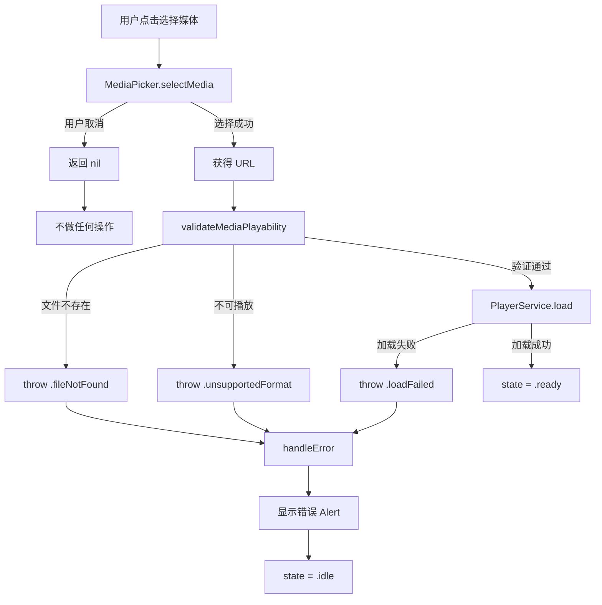
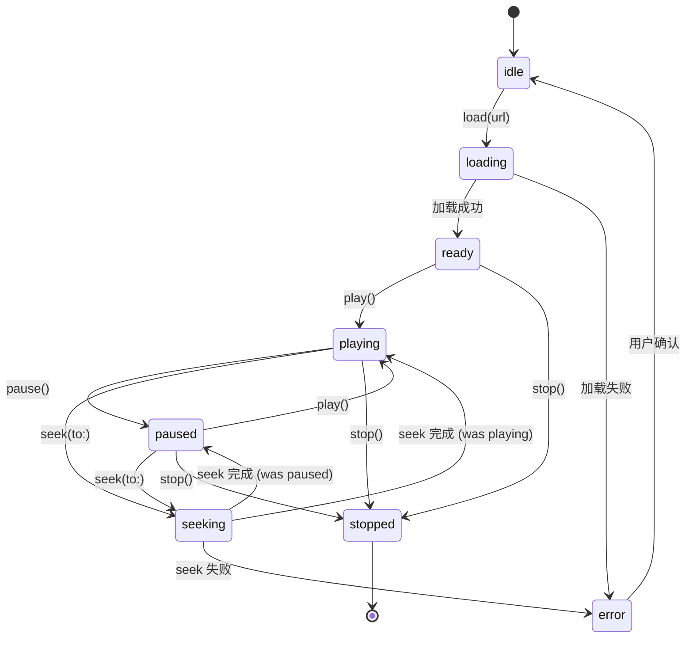
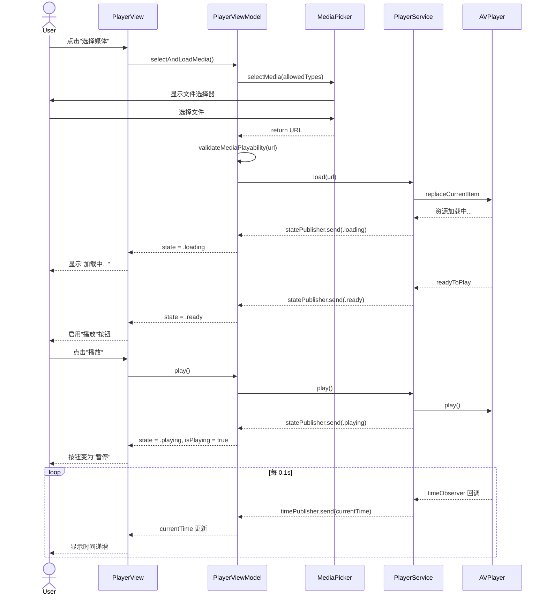

# Task-101: 媒体选择与播放（iOS 基线）v1.1

> 版本：v1.1（评审修订版）  
> 修订日期：2025-10-28  
> 原版本：v1.0  
> 修订原因：评审发现协议定义、错误处理、测试策略等关键问题

- Sprint：Sprint 1（M1 原型）
- Task：Task-101 媒体选择与播放（Media Selection & Playback）
- PBI：Sprint 1-1（PRD §6.1；US §5-1/§5-2）
- Owner：@to-assign
- 状态：Todo

## 相关 TDD
- [x] `tdd/iOS-macOS/hld-ios-macos-v0.2.md` — 采用 PlayerService 作为唯一播放抽象；以播放器进度为字幕渲染时钟（见 §2.2 PlayerService、§5 预加载）

## 相关 ADR
- [x] `docs/adr/iOS-macOS/0002-player-view-ui-stack.md` — SwiftUI + MVVM，PlayerService 以协议注入；
- [x] `docs/adr/iOS-macOS/0005-testing-di-strategy.md` — 协议式 DI 与可替换后端，使用 Mock 进行契约测试
- [x] `docs/adr/iOS-macOS/0006-unified-app-target-structure.md` — 单工程双 Target 结构，优化代码共享与维护成本

## 1. 目标与范围

### 1.1 目标（可量化）
- 选择本地视频/音频文件后，能够开始播放；支持播放/暂停；提供稳定的进度回调（≥10Hz，抖动≤50ms）供字幕渲染作为"真值时钟"。
- 首帧可见时间将在后续 PBI"极速首帧（预加载）"中优化，本 Task 不做性能保证，仅确保功能链路通。

### 1.2 范围
- iOS 基线（SwiftUI + AVFoundation）；支持 mp4/mov/m4a/aac/wav（系统可解码）；本地文件选取使用 UIDocumentPicker。
- 提供 PlayerView + ViewModel 骨架，与 PrismCore.PlayerService 对接。
- 设计层面覆盖 macOS：共享 ViewModel 与 PlayerService 契约，平台差异集中在"媒体选择器封装"和极少量 UI 修饰，保证本 Task 交付后 macOS 目标可编译通过（以占位/桩件实现），功能实现排期在 Sprint 2。

### 1.3 非目标
- macOS 端的文件选择与完整 UI 行为在本 Sprint 不做功能交付（但提供技术设计与编译通过的桩件）。
- 倍速、后台播放、音频预加载（对应后续 PBI）。

---

## 2. 方案要点

### 2.1 核心接口与协议设计

#### 2.1.1 MediaPicker 协议（新增，P0 修正）

```swift
import Foundation
import UniformTypeIdentifiers

/// 媒体选择器协议
/// 
/// 平台实现：
/// - iOS: MediaPickeriOS（基于 UIDocumentPickerViewController）
/// - macOS: MediaPickerMac（基于 NSOpenPanel）
///
/// 职责：跨平台媒体文件选择抽象
protocol MediaPicker {
    /// 选择媒体文件
    /// - Parameter allowedTypes: 允许的文件类型（UTType）
    /// - Returns: 选中的文件 URL，用户取消返回 nil
    /// - Throws: 文件访问权限错误或系统错误
    func selectMedia(allowedTypes: [UTType]) async throws -> URL?
}

/// 预定义的媒体类型集合
extension MediaPicker {
    static var supportedMediaTypes: [UTType] {
        [
            .movie,           // 通用视频
            .mpeg4Movie,      // mp4
            .quickTimeMovie,  // mov
            .audio,           // 通用音频
            .mp3,             // mp3
            .mpeg4Audio,      // m4a/aac
            .wav              // wav
        ]
    }
}
```

#### 2.1.2 PlayerViewModel 核心接口（新增，P0 修正）

```swift
import Combine
import Foundation
import PrismCore

/// 播放器 ViewModel
///
/// 职责：
/// - 管理播放器状态与 UI 绑定
/// - 协调媒体选择与播放控制
/// - 时间同步与错误处理
///
/// 依赖注入：
/// - PlayerService（播放控制）
/// - MediaPicker（文件选择）
@MainActor
final class PlayerViewModel: ObservableObject {
    // MARK: - Published State
    
    /// 当前播放时间（秒）
    @Published private(set) var currentTime: TimeInterval = 0
    
    /// 媒体总时长（秒）
    @Published private(set) var duration: TimeInterval = 0
    
    /// 播放器状态
    @Published private(set) var state: PlayerState = .idle
    
    /// 是否正在播放
    @Published private(set) var isPlaying: Bool = false
    
    /// 错误信息（用于 UI 展示）
    @Published var errorMessage: String?
    
    /// 当前加载的媒体 URL
    @Published private(set) var currentMediaURL: URL?
    
    // MARK: - Dependencies
    
    private let playerService: PlayerService
    private let mediaPicker: MediaPicker
    
    // MARK: - Private State
    
    private var cancellables = Set<AnyCancellable>()
    
    // MARK: - Initialization
    
    init(
        playerService: PlayerService,
        mediaPicker: MediaPicker
    ) {
        self.playerService = playerService
        self.mediaPicker = mediaPicker
        setupBindings()
    }
    
    // MARK: - Public Methods
    
    /// 选择并加载媒体
    func selectAndLoadMedia() async {
        do {
            // 1. 选择文件
            guard let url = try await mediaPicker.selectMedia(
                allowedTypes: MediaPicker.supportedMediaTypes
            ) else {
                // 用户取消，不做任何操作
                return
            }
            
            // 2. 验证文件可播放性
            try await validateMediaPlayability(url: url)
            
            // 3. 加载媒体
            try await playerService.load(url: url)
            
            // 4. 更新状态
            currentMediaURL = url
            errorMessage = nil
            
        } catch {
            handleError(error)
        }
    }
    
    /// 播放
    func play() async {
        await playerService.play()
    }
    
    /// 暂停
    func pause() async {
        await playerService.pause()
    }
    
    /// 跳转
    func seek(to time: TimeInterval) async {
        await playerService.seek(to: time)
    }
    
    // MARK: - Private Methods
    
    private func setupBindings() {
        // 绑定时间更新（10Hz）
        playerService.timePublisher
            .receive(on: DispatchQueue.main)
            .assign(to: &$currentTime)
        
        // 绑定状态变化
        playerService.statePublisher
            .receive(on: DispatchQueue.main)
            .sink { [weak self] state in
                self?.state = state
                self?.isPlaying = (state == .playing)
                
                // 更新时长（仅在 ready/playing 状态）
                if state == .ready || state == .playing {
                    self?.duration = self?.playerService.duration ?? 0
                }
            }
            .store(in: &cancellables)
    }
    
    private func validateMediaPlayability(url: URL) async throws {
        let asset = AVURLAsset(url: url)
        
        // 检查文件是否存在
        guard FileManager.default.fileExists(atPath: url.path) else {
            throw PlayerError.fileNotFound
        }
        
        // 检查是否可播放
        guard asset.isPlayable else {
            throw PlayerError.unsupportedFormat
        }
    }
    
    private func handleError(_ error: Error) {
        if let playerError = error as? PlayerError {
            errorMessage = playerError.errorDescription
        } else {
            errorMessage = error.localizedDescription
        }
        
        // 记录错误日志
        Logger.player.error("播放器错误: \(error.localizedDescription)")
    }
}
```

### 2.2 时间同步机制（新增，P0 修正）

#### 2.2.1 设计原则
- **唯一时钟源**：PlayerService.timePublisher 作为字幕渲染的唯一参考时钟
- **更新频率**：10Hz（每 0.1 秒发布一次），已在 PlayerService 协议中定义
- **抖动控制**：≤50ms，通过 AVPlayer 的 `addPeriodicTimeObserver` 精确控制

#### 2.2.2 实现方案

```swift
// AVPlayerService 实现片段
final class AVPlayerService: PlayerService {
    private let timeUpdateInterval: CMTime = CMTime(
        value: 1,
        timescale: 10  // 10Hz = 0.1s
    )
    
    private func setupTimeObserver() {
        timeObserver = player.addPeriodicTimeObserver(
            forInterval: timeUpdateInterval,
            queue: .main
        ) { [weak self] time in
            let seconds = CMTimeGetSeconds(time)
            self?.timeSubject.send(seconds)
        }
    }
}
```

#### 2.2.3 ViewModel 订阅

```swift
// PlayerViewModel 中的绑定（已在 2.1.2 中体现）
playerService.timePublisher
    .receive(on: DispatchQueue.main)
    .assign(to: &$currentTime)
```

#### 2.2.4 抖动验证（单元测试）

```swift
func testTimePublisherJitter() async throws {
    let mockService = MockPlayerService()
    let viewModel = PlayerViewModel(
        playerService: mockService,
        mediaPicker: MockMediaPicker()
    )
    
    var timestamps: [TimeInterval] = []
    var intervals: [TimeInterval] = []
    
    // 收集 20 次时间更新
    let expectation = XCTestExpectation(description: "Collect timestamps")
    expectation.expectedFulfillmentCount = 20
    
    viewModel.$currentTime
        .dropFirst() // 跳过初始值
        .prefix(20)
        .sink { time in
            timestamps.append(CACurrentMediaTime())
            expectation.fulfill()
        }
        .store(in: &cancellables)
    
    // 模拟 10Hz 发布
    for i in 0..<20 {
        mockService.timeSubject.send(Double(i) * 0.1)
        try await Task.sleep(nanoseconds: 100_000_000) // 0.1s
    }
    
    await fulfillment(of: [expectation], timeout: 3.0)
    
    // 计算时间间隔
    for i in 1..<timestamps.count {
        intervals.append(timestamps[i] - timestamps[i-1])
    }
    
    // 验证：平均间隔接近 0.1s，标准差 < 0.05s
    let avgInterval = intervals.reduce(0, +) / Double(intervals.count)
    let variance = intervals.map { pow($0 - avgInterval, 2) }.reduce(0, +) / Double(intervals.count)
    let stdDev = sqrt(variance)
    
    XCTAssertEqual(avgInterval, 0.1, accuracy: 0.01, "平均间隔应为 0.1s")
    XCTAssertLessThan(stdDev, 0.05, "标准差应 < 50ms")
}
```

### 2.3 错误处理流程（新增，P0 修正）

| 错误场景 | 检测点 | 错误类型 | UI 反馈 | 状态转换 | 日志级别 |
|---------|-------|---------|---------|---------|---------|
| 用户取消选择 | MediaPicker | nil URL | 无提示 | 保持 idle | debug |
| 文件不存在 | validateMediaPlayability | `.fileNotFound` | Alert: "文件未找到" | idle → idle | error |
| 不支持格式 | AVURLAsset.isPlayable | `.unsupportedFormat` | Alert: "不支持的格式，请选择 mp4/mov/m4a/wav" | idle → idle | warning |
| 加载失败 | PlayerService.load | `.loadFailed(msg)` | Alert: "加载失败：\(msg)" | loading → error → idle | error |
| Seek 失败 | PlayerService.seek | `.seekFailed` | Toast: "跳转失败" | 保持上一状态 | warning |
| 未知错误 | catch块 | `.unknown(error)` | Alert: error.localizedDescription | → error → idle | error |

#### 2.3.1 错误处理流程图



### 2.4 macOS 技术设计（与 iOS 共享方案）

#### 2.4.1 共享层
- 复用 `PrismCore.PlayerService` 协议与实现
- `PlayerViewModel` 与业务状态机与 iOS 完全共享（同一份代码）
- 以 `Combine`/`AnyPublisher<TimeInterval,Never>` 为唯一渲染时钟来源

#### 2.4.2 平台差异封装
- 媒体选择器：通过 `MediaPicker` 协议抽象，平台实现分离
- SwiftUI 适配：采用条件编译 `#if os(macOS)`/`#if os(iOS)` 提供 `MediaPickerRepresentable`
- 其余 UI 采用共享 View，以 `ViewModifier` 处理小差异

#### 2.4.3 macOS 占位实现范围（明确，P0 修正）

**本 Sprint 交付（Sprint 1）**：
- [x] `MediaPickerMac.swift` 存在且符合 `MediaPicker` 协议
- [x] `selectMedia()` 返回 `nil`（带 `TODO` 注释和日志）
- [x] macOS 目标编译通过（零错误、零警告）
- [x] 运行 macOS App 不崩溃
- [x] 显示占位 UI：
  ```swift
  Text("macOS 文件选择功能即将推出")
      .foregroundColor(.secondary)
      .font(.callout)
  ```

**Sprint 2 补充（完整实现）**：
- [ ] `NSOpenPanel` 完整实现
- [ ] 文件类型过滤（UTType 映射到 `allowedContentTypes`）
- [ ] 安全作用域书签（如需持久访问）
- [ ] E2E 测试（选择 → 播放 → 时间更新 → 暂停）

#### 2.4.4 占位实现代码示例

```swift
// MediaPickerMac.swift (Sprint 1 占位实现)
import Foundation
import UniformTypeIdentifiers
import OSLog

#if os(macOS)
final class MediaPickerMac: MediaPicker {
    private let logger = Logger(subsystem: "com.prismplayer.app", category: "MediaPicker")
    
    func selectMedia(allowedTypes: [UTType]) async throws -> URL? {
        logger.info("macOS 文件选择功能占位调用")
        
        // TODO: Sprint 2 实现 NSOpenPanel
        // let panel = NSOpenPanel()
        // panel.allowedContentTypes = allowedTypes
        // panel.allowsMultipleSelection = false
        // panel.canChooseDirectories = false
        // ...
        
        return nil  // 占位返回，不触发后续加载
    }
}
#endif
```

### 2.5 目录与文件结构（修正，P0，基于 ADR-0006）

**实际路径**（单工程双 Target 结构）：

```
Prism-xOS/
├── PrismPlayer.xcworkspace
├── apps/
│   └── PrismPlayer/                             # 单工程（ADR-0006）
│       ├── PrismPlayer.xcodeproj
│       │   ├── PrismPlayer-iOS.xcscheme
│       │   └── PrismPlayer-macOS.xcscheme
│       └── Sources/
│           ├── iOS/                             # iOS 专用（Target: iOS）
│           │   ├── PrismPlayerApp.swift
│           │   ├── Info.plist
│           │   └── Platform/
│           │       └── MediaPickeriOS.swift     # iOS 文件选择器
│           ├── macOS/                           # macOS 专用（Target: macOS）
│           │   ├── PrismPlayerApp.swift
│           │   ├── Info.plist
│           │   ├── PrismPlayer_macOS.entitlements
│           │   └── Platform/
│           │       └── MediaPickerMac.swift     # macOS 文件选择器（占位）
│           ├── Shared/                          # 共享代码（Target: Both）
│           │   ├── Player/
│           │   │   ├── PlayerView.swift         # 共享 UI（80%）
│           │   │   └── PlayerViewModel.swift    # 完全共享
│           │   └── Resources/
│           │       └── Localizable.xcstrings    # 国际化资源
│           └── Tests/
│               ├── Shared/                      # 跨平台测试
│               │   └── PlayerViewModelTests.swift
│               └── Platform/                    # 平台特定测试
│                   ├── iOS/
│                   └── macOS/
├── packages/
│   └── PrismCore/
│       └── Sources/PrismCore/
│           └── Player/
│               ├── PlayerService.swift          # 已存在
│               └── AVPlayerService.swift        # 新建（实现 PlayerService）
└── Tests/
    └── Mocks/
        ├── MockPlayerService.swift              # 已存在
        └── MockMediaPicker.swift                # 新建
```

**Target Membership 策略**：
| 文件/文件夹 | iOS Target | macOS Target | 说明 |
|-----------|-----------|-------------|------|
| `iOS/*` | ✅ | ❌ | iOS 专用代码 |
| `macOS/*` | ❌ | ✅ | macOS 专用代码 |
| `Shared/*` | ✅ | ✅ | 跨平台共享代码（80%） |
| `Shared/Resources/` | ✅ | ✅ | 共享资源（国际化、Assets） |

**优势**（ADR-0006）：
- ✅ `PlayerViewModel.swift` 只需维护一份（自动对两个 Target 可见）
- ✅ 配置统一（SwiftLint、Build Settings）
- ✅ 国际化资源自动复用
- ✅ Git 冲突风险降低（单一 `.xcodeproj`）

### 2.6 国际化 Key 清单（新增，P1）

| Key | en-US | zh-Hans | 用途 | 备注 |
|-----|-------|---------|------|------|
| `player.select_media` | Select Media | 选择媒体 | 按钮文本 | - |
| `player.play` | Play | 播放 | 按钮文本 | - |
| `player.pause` | Pause | 暂停 | 按钮文本 | - |
| `player.time_format` | %@ / %@ | %@ / %@ | 时间显示 | 格式：00:00 / 00:00 |
| `player.loading` | Loading... | 加载中... | 状态提示 | - |
| `player.error.file_not_found` | File not found | 文件未找到 | 错误提示 | 与 PlayerError 一致 |
| `player.error.unsupported_format` | Unsupported media format. Please select mp4/mov/m4a/wav files. | 不支持的媒体格式，请选择 mp4/mov/m4a/wav 文件。 | 错误提示 | 与 PlayerError 一致 |
| `player.error.load_failed` | Failed to load media: %@ | 加载媒体失败：%@ | 错误提示 | 与 PlayerError 一致 |
| `player.error.seek_failed` | Failed to seek | 跳转失败 | 错误提示 | 与 PlayerError 一致 |
| `player.macos_coming_soon` | macOS file selection coming soon | macOS 文件选择功能即将推出 | 占位文本 | Sprint 1 专用 |

**重要**：所有 key 必须与 `PlayerError.errorDescription` 中使用的 `NSLocalizedString` key 完全一致。

---

## 3. 改动清单

### 3.1 新建文件

**统一工程**（基于 ADR-0006）：
- `apps/PrismPlayer/PrismPlayer.xcodeproj`（新建单工程，替换原有双工程）

**iOS 专用**：
- `apps/PrismPlayer/Sources/iOS/Platform/MediaPickeriOS.swift`

**macOS 专用**：
- `apps/PrismPlayer/Sources/macOS/Platform/MediaPickerMac.swift`（占位）

**共享代码**：
- `apps/PrismPlayer/Sources/Shared/Player/PlayerView.swift`
- `apps/PrismPlayer/Sources/Shared/Player/PlayerViewModel.swift`

**Core 层**：
- `packages/PrismCore/Sources/PrismCore/Player/AVPlayerService.swift`（实现 PlayerService）

**测试**：
- `Tests/Mocks/MockMediaPicker.swift`

**资源**：
- `apps/PrismPlayer/Sources/Shared/Resources/Localizable.xcstrings`

### 3.2 修改文件

**工程迁移**（ADR-0006 迁移任务，在 PR1 前完成）：
- 删除：`apps/PrismPlayer-iOS/PrismPlayer-iOS.xcodeproj`
- 删除：`apps/PrismPlayer-macOS/PrismPlayer-macOS.xcodeproj`
- 新建：`apps/PrismPlayer/PrismPlayer.xcodeproj`（单工程双 Target）

**配置**：
- `Prism-xOS/PrismPlayer.xcworkspace/contents.xcworkspacedata`：更新工程引用
- `.swiftlint.yml`：路径更新为 `apps/PrismPlayer/Sources/`

**文档**：
- `CHANGELOG.md`：记录本 Task 新增功能
- `docs/scrum/iOS-macOS/tasks/sprint-1/task-101-media-selection-and-playback.md`：更新 DoD 检查清单

### 3.3 接口/协议变更

- **无需修改** `PrismCore.PlayerService` 协议（已满足需求）
- **新增** `MediaPicker` 协议（UI 层，不进入 PrismCore）
- **新增** `AVPlayerService` 类（实现 PlayerService）

### 3.4 数据/迁移

- 无持久化变更（本 Task 不涉及数据存储）

---

## 4. 实施计划（细化至提交）

### 提交规范
- 遵循 Conventional Commits
- 每个步骤确保 iOS 与 macOS 目标均可编译（macOS 允许占位实现）
- 每次 commit 包含对应的单元测试

### PR1：核心协议与 ViewModel 骨架（共享）

**前置任务**：完成工程迁移（ADR-0006，约 4h）
- [ ] 执行迁移脚本 `scripts/migrate-to-unified-project.sh`
- [ ] 验证双 Target 编译通过
- [ ] 更新 Workspace 引用

**目标**：建立播放器的核心抽象层与测试基础设施

- **commit 1**: `feat(player): add MediaPicker protocol and platform stubs`
  - 新建 `MediaPicker` 协议定义（Shared/Player/MediaPicker.swift）
  - iOS: `MediaPickeriOS.swift`（iOS/Platform/，占位返回 nil）
  - macOS: `MediaPickerMac.swift`（macOS/Platform/，占位返回 nil）
  - 新建 `MockMediaPicker.swift`
  - 设置正确的 Target Membership（iOS/macOS/Both）

- **commit 2**: `feat(player): add PlayerViewModel with PlayerService DI and state bindings`
  - 实现 `PlayerViewModel`（Shared/Player/，完整逻辑，参考 2.1.2）
  - 依赖注入 `PlayerService` 和 `MediaPicker`
  - 设置 Combine 绑定（timePublisher、statePublisher）
  - Target Membership: Both（iOS + macOS）

- **commit 3**: `test(player): add ViewModel unit tests using MockPlayerService`
  - 测试加载成功路径（idle → loading → ready）
  - 测试播放/暂停状态转换
  - 测试时间同步（含抖动验证，参考 2.2.4）
  - 测试错误处理（所有 PlayerError 场景）
  - 测试用户取消选择（不触发 load）
  - 覆盖率目标：≥70%

- **commit 4**: `chore(i18n): add player.* keys to String Catalog (zh-Hans/en-US)`
  - 新建或更新 `Shared/Resources/Localizable.xcstrings`
  - 添加所有 player.* key（参考 2.6）
  - Target Membership: Both
  - 验证：无硬编码字符串

**验收检查**：
- [x] iOS/macOS 编译通过（统一工程）
- [x] 单元测试通过（覆盖率 ≥70%）
- [x] SwiftLint 零警告
- [x] 国际化 key 完整
- [x] Target Membership 设置正确

---

### PR2：AVPlayerService 实现与集成

**目标**：提供真实的播放器实现，替换 Mock

- **commit 1**: `feat(player): implement AVPlayerService with 10Hz time observer`
  - 实现 `AVPlayerService`（基于 AVPlayer）
  - 配置 `addPeriodicTimeObserver(interval: 0.1s)`
  - 实现 load/play/pause/seek 方法
  - 错误映射到 `PlayerError`

- **commit 2**: `test(player): add AVPlayerService integration tests`
  - 使用 `Tests/Fixtures/audio/` 中样本
  - 测试加载真实媒体文件
  - 测试时间发布频率（≥9Hz，允许系统波动）
  - 测试不支持格式的错误处理

- **commit 3**: `refactor(player): wire AVPlayerService into PlayerViewModel`
  - 在 App 入口注入 `AVPlayerService`
  - 移除 Mock 依赖（仅保留测试中使用）

**验收检查**：
- [x] 真实播放器功能验证（选择文件 → 播放 → 时间递增）
- [x] 集成测试通过
- [x] 时间发布频率达标

---

### PR3：iOS 文件选择器实现

**目标**：完成 iOS 平台的完整文件选择功能

- **commit 1**: `feat(player-ios): implement UIDocumentPicker-based MediaPickeriOS`
  - 实现 `UIViewControllerRepresentable`
  - 配置 `allowedContentTypes`（使用 UTType）
  - 处理用户选择与取消

- **commit 2**: `test(player-ios): add MediaPickeriOS behavior tests`
  - 测试文件类型过滤
  - 测试取消行为（返回 nil）
  - （可选）UI Test 验证选择器弹出

- **commit 3**: `feat(player): inject platform MediaPicker into shared PlayerView`
  - 条件编译注入不同的 `MediaPicker` 实现
  - iOS: `MediaPickeriOS`
  - macOS: `MediaPickerMac`（占位）

**验收检查**：
- [x] iOS 文件选择器可正常弹出
- [x] 文件类型过滤正确
- [x] 用户取消不触发加载

---

### PR4：PlayerView UI 与状态绑定

**目标**：构建完整的播放器 UI

- **commit 1**: `feat(player): add PlayerView with play/pause and time binding`
  - 实现 `PlayerView`（SwiftUI）
  - 选择媒体按钮
  - 播放/暂停按钮（根据 `isPlaying` 切换）
  - 时间显示（currentTime / duration）
  - 错误 Alert

- **commit 2**: `feat(player): integrate AVPlayerLayer/AVPlayerView for video rendering`
  - iOS: `UIViewRepresentable` 包裹 `AVPlayerLayer`
  - macOS: `NSViewRepresentable` 包裹 `AVPlayerView`
  - 参考 ADR-0002 混合方案

- **commit 3**: `style(i18n): replace hardcoded strings with catalog keys`
  - 使用 `String(localized: "player.play")` 等
  - 验证：`grep -r "\".*\"" Sources/Player/` 无硬编码

**验收检查**：
- [x] UI 布局合理（安全区、按钮状态）
- [x] 状态绑定正确（按钮禁用/启用）
- [x] 无硬编码字符串

---

### PR5：错误处理、验证与文档

**目标**：完善错误处理与最终验收

- **commit 1**: `feat(player): validate selected URL playability and map to PlayerError`
  - 实现 `validateMediaPlayability`（参考 2.1.2）
  - 错误映射（参考 2.3）
  - 友好错误文案

- **commit 2**: `test(player): add error/unsupported format/selection cancel tests`
  - 测试所有错误场景（参考 2.3 表格）
  - 验证错误提示正确显示
  - 验证状态转换符合预期

- **commit 3**: `feat(player): add OSLog integration for player events`
  - 配置 OSLog（subsystem/category）
  - 记录 load_start/load_ready/play/pause/seek/error
  - 错误日志包含 code 和 message

- **commit 4**: `docs(task): update Task-101 DoD checklist and CHANGELOG`
  - 更新 DoD 检查清单
  - 更新 CHANGELOG.md
  - 记录已知问题与 Sprint 2 计划

**验收检查**：
- [x] 所有错误场景测试通过
- [x] 日志输出完整
- [x] 文档更新

---

### 验收前检查（每 PR CI gate）

- [x] **构建**：iOS 17+/macOS 14+ Debug 构建通过
- [x] **Lint**：SwiftLint 严格模式零警告
- [x] **测试**：ViewModel 单测通过，覆盖率达标（VM ≥70%，关键路径 ≥80%）
- [x] **i18n**：无硬编码字符串（通过 grep 验证）
- [x] **macOS**：占位实现编译通过，运行不崩溃

---

## 5. 测试与验收

### 5.1 单元测试策略（XCTest，目标：VM ≥70%，关键路径 ≥80%）

#### 5.1.1 PlayerViewModel 测试

**状态转换（关键路径 ≥80%）**：
```swift
func testLoadMediaSuccess() async throws {
    // Given
    let mockService = MockPlayerService()
    let mockPicker = MockMediaPicker()
    mockPicker.mockURL = URL(fileURLWithPath: "/path/to/test.mp4")
    
    let viewModel = PlayerViewModel(
        playerService: mockService,
        mediaPicker: mockPicker
    )
    
    // When
    await viewModel.selectAndLoadMedia()
    
    // Then
    XCTAssertEqual(viewModel.state, .ready)
    XCTAssertEqual(viewModel.currentMediaURL, mockPicker.mockURL)
    XCTAssertNil(viewModel.errorMessage)
}

func testUserCancelSelection() async throws {
    // Given
    let mockPicker = MockMediaPicker()
    mockPicker.mockURL = nil  // 模拟用户取消
    
    let viewModel = PlayerViewModel(
        playerService: MockPlayerService(),
        mediaPicker: mockPicker
    )
    
    // When
    await viewModel.selectAndLoadMedia()
    
    // Then
    XCTAssertEqual(viewModel.state, .idle)
    XCTAssertNil(viewModel.currentMediaURL)
    // 验证未调用 PlayerService.load
}

func testPlayPauseStateTransitions() async throws {
    // 测试 idle → ready → playing → paused
}

func testSeekFailureKeepsPreviousState() async throws {
    // 测试 seek 失败时保持上一状态
}
```

**时间同步（参考 2.2.4）**：
```swift
func testTimePublisherForwarding() async throws {
    // 验证 timePublisher 正确转发到 currentTime
}

func testTimePublisherJitter() async throws {
    // 验证抖动 < 50ms（参考 2.2.4 完整实现）
}
```

**错误处理（覆盖 2.3 所有场景）**：
```swift
func testFileNotFoundError() async throws {
    // Given
    let mockPicker = MockMediaPicker()
    mockPicker.mockURL = URL(fileURLWithPath: "/nonexistent.mp4")
    
    // When
    await viewModel.selectAndLoadMedia()
    
    // Then
    XCTAssertEqual(viewModel.state, .idle)
    XCTAssertNotNil(viewModel.errorMessage)
    XCTAssertTrue(viewModel.errorMessage!.contains("文件未找到"))
}

func testUnsupportedFormatError() async throws {
    // 测试 .unsupportedFormat 错误
}

func testLoadFailedError() async throws {
    // 测试 .loadFailed 错误
}
```

#### 5.1.2 AVPlayerService 测试（集成测试）

```swift
func testLoadRealMediaFile() async throws {
    // 使用 Tests/Fixtures/audio/sample.m4a
    let service = AVPlayerService()
    let url = Bundle.module.url(forResource: "sample", withExtension: "m4a")!
    
    try await service.load(url: url)
    
    XCTAssertGreaterThan(service.duration, 0)
    XCTAssertEqual(service.currentTime, 0, accuracy: 0.1)
}

func testTimePublisherFrequency() async throws {
    // 验证发布频率 ≥9Hz（允许系统波动）
}
```

### 5.2 UI 测试策略（可选，Sprint 2）

- **iOS**: XCUITest 选择文件并播放
- **macOS**: 占位实现不做 UI 测试，仅编译验证

### 5.3 集成/E2E 测试

**iOS**：
- [ ] 使用 `Tests/Fixtures/audio/` 中 10–30s 样本
- [ ] 真机/模拟器验证：
  - 选择媒体 → 文件选择器弹出
  - 选择文件 → 加载成功
  - 点击播放 → 按钮变为暂停，时间递增
  - 点击暂停 → 按钮变为播放，时间停止
  - 选择不支持格式 → 显示错误提示

**macOS**：
- [ ] 编译运行应用
- [ ] 显示占位 UI："macOS 文件选择功能即将推出"
- [ ] 点击选择媒体 → 无崩溃，日志记录占位调用
- [ ] 其他功能不受影响

### 5.4 性能验证（P1）

**首帧时间测量**：
```swift
func testFirstFrameTime() async throws {
    let startTime = CACurrentMediaTime()
    
    // 选择媒体 → 加载 → 播放
    await viewModel.selectAndLoadMedia()
    await viewModel.play()
    
    let firstFrameTime = CACurrentMediaTime() - startTime
    
    // 记录样本（不做阈值考核，供 Sprint 2 使用）
    Logger.metrics.info("首帧时间: \(firstFrameTime)s")
}
```

### 5.5 验收标准（与 Sprint 计划一致）

- [ ] 支持本地视频/音频选择（iOS，UIDocumentPicker）
- [ ] 支持播放/暂停
- [ ] 提供稳定的进度回调作为字幕渲染时钟（≥10Hz），UI 可读当前时间
- [ ] 错误处理完善，用户友好提示
- [ ] macOS 目标可编译通过（占位实现）

---

## 6. 观测与验证

### 6.1 日志规范（P1）

#### 6.1.1 OSLog 配置

```swift
import OSLog

extension Logger {
    static let player = Logger(
        subsystem: "com.prismplayer.app",
        category: "Player"
    )
}
```

#### 6.1.2 事件与级别

| 事件 | 级别 | 格式 | 示例 |
|-----|------|------|------|
| load_start | info | "开始加载媒体: \(url.lastPathComponent)" | "开始加载媒体: sample.mp4" |
| load_ready | info | "媒体加载成功，时长: \(duration)s" | "媒体加载成功，时长: 180.5s" |
| play | debug | "开始播放" | "开始播放" |
| pause | debug | "暂停播放" | "暂停播放" |
| seek | debug | "跳转到: \(time)s" | "跳转到: 60.0s" |
| error | error | "播放器错误: \(code) - \(message)" | "播放器错误: unsupportedFormat - 不支持的格式" |

#### 6.1.3 实现示例

```swift
// PlayerViewModel 中的日志
func selectAndLoadMedia() async {
    do {
        guard let url = try await mediaPicker.selectMedia(...) else {
            Logger.player.debug("用户取消选择媒体")
            return
        }
        
        Logger.player.info("开始加载媒体: \(url.lastPathComponent)")
        try await playerService.load(url: url)
        Logger.player.info("媒体加载成功，时长: \(playerService.duration)s")
        
    } catch {
        Logger.player.error("播放器错误: \(error.localizedDescription)")
        handleError(error)
    }
}
```

### 6.2 指标采集（最小化）

**首帧样本时间戳**（供后续 PBI 使用，不做阈值考核）：

```swift
// MetricsService（占位，Sprint 2 完善）
actor MetricsService {
    func recordFirstFrameTime(_ duration: TimeInterval) {
        // 本地存储样本（SQLite 或 UserDefaults）
        Logger.metrics.info("首帧时间样本: \(duration)s")
    }
}
```

### 6.3 验证方法

#### 6.3.1 本地验证

**iOS**：
- [ ] 模拟器（iPhone 15 Pro, iOS 17.5+）
- [ ] 真机（至少 1 台，iOS 17+）
- [ ] 验证格式：mp4、mov、m4a、wav
- [ ] 验证时间递增（播放 10s，观察 UI 更新）

**macOS**：
- [ ] macOS 14.0+ (Apple Silicon 优先)
- [ ] 编译运行应用
- [ ] 验证占位 UI 显示
- [ ] 验证日志输出正确
- [ ] 验证无崩溃

#### 6.3.2 CI 验证

- [ ] 构建矩阵：iOS 17+ / macOS 14+
- [ ] 单元测试通过（所有 PR）
- [ ] 覆盖率报告（≥70%，关键路径 ≥80%）
- [ ] SwiftLint 严格模式零警告
- [ ] 国际化检查（无硬编码字符串）

---

## 7. 风险与缓解

### 7.1 风险矩阵（P1）

| 风险ID | 风险描述 | 概率 | 影响 | 缓解措施 | 负责人 | 状态 |
|-------|---------|------|------|---------|-------|------|
| R-A | 部分容器/编码 iOS 不支持 | 中 | 中 | `AVURLAsset.isPlayable` 检查 + 友好提示 + 建议格式 | @owner | 待实施 |
| R-B | 时间发布频率 <10Hz | 低 | 低 | 使用 `addPeriodicTimeObserver(interval: 0.1s)` + 单元测试验证 | @owner | 待验证 |
| R-C | macOS 沙盒权限/文件访问 | - | - | **推迟到 Sprint 2**（安全作用域书签） | - | 延期 |
| R-D | NSOpenPanel 沙盒行为差异 | - | - | **推迟到 Sprint 2**（默认配置测试） | - | 延期 |
| R-E | AVPlayer 后台限制影响测试 | 低 | 低 | 测试在前台运行；后台行为 Sprint 2 处理 | @owner | 监控 |
| R-F | 不同设备时间精度差异 | 低 | 低 | 允许 ±10ms 波动；记录设备型号与样本 | @owner | 监控 |

### 7.2 未决问题

- [x] **Q1**: PlayerViewModel 是通过 Swift Package 共享还是 Target Membership 共享？
  - **已决策**（ADR-0006）：使用 Target Membership 共享（Shared 文件夹 → Both Targets）
  
- [ ] **Q2**: 是否需要支持拖拽文件（macOS）？
  - **建议**：Sprint 2 作为增强功能

- [ ] **Q3**: 错误提示是 Alert 还是 Toast？
  - **建议**：关键错误用 Alert；一般提示用 Toast（需定义 Toast 组件）

---

## 8. 定义完成（DoD）

### 8.1 功能完成度

- [ ] iOS 支持本地视频/音频选择（UIDocumentPicker）
- [ ] 支持播放/暂停，按钮状态正确
- [ ] 提供稳定的进度回调（≥10Hz），UI 可读当前时间
- [ ] 错误处理完善，所有 PlayerError 场景有友好提示
- [ ] macOS 目标可编译通过（占位实现，运行不崩溃）

### 8.2 质量保证

- [ ] CI 通过（iOS/macOS 构建矩阵）
- [ ] 单元测试通过，覆盖率达标：
  - PlayerViewModel ≥70%
  - 关键路径（状态转换、错误处理）≥80%
- [ ] SwiftLint 严格模式零警告
- [ ] 无硬编码字符串（通过 grep 验证）
- [ ] 国际化完整（所有 player.* key 存在，zh-Hans/en-US 齐备）

### 8.3 文档与可观测性

- [ ] CHANGELOG.md 更新（记录本 Task 新增功能）
- [ ] 本文档 DoD 清单全部勾选
- [ ] OSLog 埋点到位（load/play/pause/seek/error）
- [ ] 首帧时间样本记录（供后续使用）

### 8.4 跨平台补充

- [ ] macOS 占位实现符合规范（2.4.3）
- [ ] 共享代码（PlayerViewModel）在两个平台均可用
- [ ] 条件编译正确（`#if os(iOS)` / `#if os(macOS)`）

---

## 9. 附录

### 9.1 状态转换图（P2）



### 9.2 序列图：选择媒体到播放（P2）



### 9.3 参考资料

- [AVFoundation Programming Guide](https://developer.apple.com/documentation/avfoundation)
- [Combine Framework](https://developer.apple.com/documentation/combine)
- [SwiftUI MVVM Best Practices](https://www.swiftbysundell.com/articles/mvvm-in-swift/)
- [UniformTypeIdentifiers](https://developer.apple.com/documentation/uniformtypeidentifiers)

---

**文档版本控制**：
- v1.0: 初始版本（2025-10-24）
- v1.1: 评审修订版（2025-10-28）
  - 补充协议定义（MediaPicker、PlayerViewModel 核心接口）
  - 明确时间同步机制与抖动验证
  - 完善错误处理流程表与流程图
  - 细化测试策略（单元/集成/性能）
  - 明确 macOS 占位实现范围
  - 补充国际化 Key 清单
  - 修正文件路径与实际代码库一致
  - 补充日志规范与风险矩阵
  - 新增状态转换图与序列图

---

**审阅人签字**：
- [ ] 技术负责人：___________ 日期：___________
- [ ] 测试负责人：___________ 日期：___________
- [ ] 产品负责人：___________ 日期：___________
