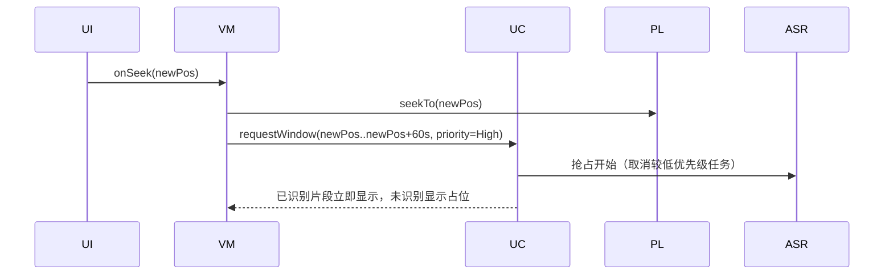
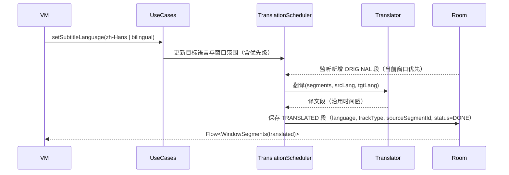
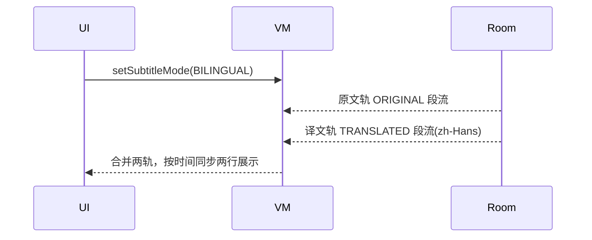

# Prism Player Android 高层架构设计（HLD）v0.2

> 日期：2025-10-25  
> 关联文档：`docs/requirements/prd_v0.2.md`、`docs/tdd/feasibility/technical-feasibility-android-v0.2.md`、`docs/adr/iOS-macOS/0001-0005`

## 0. 评审反馈与改进说明（v0.2 → v0.2.1）
参考评审文档：
- `docs/tdd/Android/reviews/hld-android-v0.2-review-claud.md`
- `docs/tdd/Android/reviews/hld-android-v0.2-review-gemini2.5.md`

本次根据评审意见进行了以下关键更新：
- D001（P0）：补充翻译字幕数据模型，新增 `language`、`trackType(ORIGINAL/TRANSLATED)`、`sourceSegmentId`、`translationStatus` 字段；更新 ER 图与时间索引，支持多语言/多轨并存与导出。
- D002（P0）：补充“质量感知”设计：低置信度样式、按段重识别（更高精度模型）、简单评分（1–5）。新增 `QualityUseCase` 接口、交互与序列图示例。
- D003（P1）：完善“双语字幕 UI”细节：两行布局（上原文/下翻译）、字号/背景/安全区策略与示例代码片段。
- D004（P1）：明确 ASR 与翻译调度优先级与解耦：引入 `TranslationScheduler`，采用独立流水线观察 `ORIGINAL` 段并生成 `TRANSLATED` 段；定义 `TaskPriority` 等级与抢占策略；补充序列图。
- D005（P1）：补充内存压力响应与 LRU 实现细节：`onTrimMemory` 策略与缓存 Key 设计。
- BG（背景执行）：明确后台长任务通过 Foreground Service + WorkManager 执行，并提供持久化通知（暂停/取消）。
- 其他：补充错误码映射、测试覆盖点、删除模型至少保留一个可用模型、里程碑 M3 增加“质量感知功能落地”。

## 1. 目的与范围
- 目标：在 Android 端实现“离线 ASR + 实时字幕 + 可选离线翻译”的播放器，满足 PRD v0.2 的功能与 KPI 指标。
- 范围：播放器、音频抽取、ASR、翻译、字幕渲染与导出、模型管理、存储与设置、指标与日志、国际化与可访问性。
- 非目标（v0.2）：云端识别/账户系统、说话人分离、视频烧录导出、重度字幕编辑。

## 2. 成功指标（与 PRD 对齐）
- 首帧字幕可见时间（P95）：高端 ≤5s / 中端 ≤8s / 入门 ≤12s。
- 时间同步偏差：≤ ±200ms（以播放器 position 为唯一时钟）。
- 本地处理率（RTF）：高端 ≥1.0 / 中端 ≥0.5 / 入门 ≥0.3。
- 导出成功率 ≥99%；字幕连续可见；缺口显示占位状态并尽快补齐。

## 3. 总体架构概览
- 技术栈：Kotlin、Jetpack Compose、Media3(ExoPlayer)、Hilt DI、Coroutines/Flow、Room(SQLite)、WorkManager/DownloadManager、NDK(Whisper.cpp / Vosk)、ONNX Runtime Mobile（翻译可选）。
- 最低 API 级别：Android 9.0 (API 28)，目标 API 34。

```mermaid
flowchart LR
  subgraph UI[Compose UI]
    PlayerScreen --> SubtitleOverlay
    SettingsScreen
    ModelManagerScreen
  end

  UI <--> VM[ViewModel (MVVM, Flow)]
  VM --> UC[UseCases / Interactors]

  subgraph Core Services
    PL[Player (Media3/ExoPlayer)]
    EX[Audio Extractor (AudioProcessor, resample 16kHz mono)]
    ASR[ASR Engine (Whisper.cpp/Vosk via NDK)]
    TR[Translator (ONNX Runtime / local NMT)]
    SUB[Subtitle Orchestrator (assembler/merger)]
    ST[Storage (Room/SQLite)]
    MM[Model Manager (download/import/verify)]
    CFG[Settings & Feature Flags]
    MET[Metrics & Logging (Timber)]
  end

  UC <--> PL
  PL --> EX --> ASR --> SUB
  SUB --> ST
  UC <--> TR --> ST
  UC <--> MM --> ST
  VM <--> ST
  VM --> MET
```

- 架构风格：MVVM + UseCase 分层，业务能力模块化，"协议式/接口式"抽象方便测试替换（参考 ADR-0005）。

## 4. 模块与包组织
- 包命名建议：`com.prism.player.*`
  - `ui.*`：`player`, `settings`, `models`, `download`, `translate`
  - `feature.*`：`playback`, `asr`, `translate`, `subtitles`, `export`
  - `core.*`：`audio`, `storage`, `modelmgr`, `metrics`, `di`, `config`, `util`
  - `data.*`：`dao`, `entities`, `repository`
  - `domain.*`：`usecase`, `models`

示例目录（逻辑层面）：
- feature/playback：Media3 控制、倍速、seek 事件总线（Flow）
- core/audio：ExoPlayer AudioProcessor 抽头与 16kHz/mono 重采样
- feature/asr：分段识别调度器、窗口优先级、RTF 自适应
- feature/translate：翻译流水线与占位
- feature/subtitles：段合并、断句、渲染同步
- core/modelmgr：下载/导入/删除/校验（SHA-256）
- core/storage：Room 实体/DAO/迁移
- core/metrics：首帧/RTF/延迟 P95 等指标

## 5. 数据模型与存储（Room）
- 实体（更新后）：
  - `SubtitleSegment`: 
    - `id(PK), mediaId(FK), startMs, endMs, text`
    - `language: String`（如 `en`, `zh-Hans`）
    - `trackType: TrackType`（`ORIGINAL` | `TRANSLATED`）
    - `sourceSegmentId: String?`（翻译轨指向对应原文段）
    - `confidence: Float?`（0.0–1.0）
    - `translationStatus: TranslationStatus?`（`PENDING`/`DONE`/`FAILED`，仅翻译轨）
  - `MediaFile`: `id(PK), uri, durationMs, recognitionProgress, modelId, language`
  - `ModelMetadata`: `id(PK), name, size, backend, version, path, status, sha256, languages`
  - `Settings`: `id(PK=1), subtitleStyle, preloadSeconds, languageHint, targetLanguage`
- 索引与约束：
  - `subtitle_segments(media_id, start_ms, end_ms)` 复合索引（时间窗口查询）；
  - `subtitle_segments(media_id, track_type, language, start_ms)` 复合索引（按轨与语言高效查询/导出/双语展示）；
  - 外键：`subtitle_segments.media_id -> media_files.id`，`subtitle_segments.source_segment_id -> subtitle_segments.id`（可选）；
  - WAL 模式，定期 VACUUM；
  - 临时缓存或中间文件采用 LRU 管理（≤10MB，见 PRD 6.2）。

```mermaid
erDiagram
  MEDIA_FILES ||--o{ SUBTITLE_SEGMENTS : contains
  MODELS ||--o{ MEDIA_FILES : uses
  SETTINGS ||--|| SETTINGS : singleton

  MEDIA_FILES {
    string id PK
    string uri
    long durationMs
    float recognitionProgress
    string modelId FK
    string language
  }
  SUBTITLE_SEGMENTS {
    string id PK
    string mediaId FK
    long startMs
    long endMs
    string text
    string language
    string trackType // ORIGINAL | TRANSLATED
    string sourceSegmentId FK
    float confidence
    string translationStatus // PENDING | DONE | FAILED
  }
  MODELS {
    string id PK
    string name
    long size
    string backend
    string version
    string path
    string status
    string sha256
    string languages
  }
  SETTINGS {
    int id PK
    string subtitleStyle
    int preloadSeconds
    string languageHint
    string targetLanguage
  }
```

## 6. 关键流程设计（序列）
### 6.1 首帧字幕（选中媒体 → 首条字幕）
```mermaid
sequenceDiagram
  participant U as User
  participant UI as PlayerScreen
  participant VM as ViewModel
  participant UC as UseCases
  participant PL as ExoPlayer
  participant EX as Extractor
  participant ASR as ASR Engine
  participant ST as Room

  U->>UI: 选择媒体 URI
  UI->>VM: onMediaSelected(uri)
  VM->>UC: preparePlayback(uri, preload=30s)
  UC->>PL: setMediaItem(uri); prepare()
  UC->>EX: 预取 0-30s PCM
  EX->>ASR: 分段识别(0-10s)
  ASR-->>UC: 段结果(start,end,text)
  UC->>ST: 保存段
  UC-->>VM: Flow<WindowSegments>
  VM-->>UI: 首条字幕渲染（P95 ≤ KPI）
```

### 6.2 播放中滚动识别
- 以 10–30s 窗口滚动；窗口优先级：抢占（seek 后 60s）> 当前窗口滚动 > 预加载。
- UI 每帧不刷新，段变更才触发，最大 10–15Hz。

### 6.3 进度拖动抢占


### 6.4 字幕翻译（en→zh-Hans）
解耦设计：引入 `TranslationScheduler`，作为独立流水线观察 `ORIGINAL` 段，依据窗口优先级和目标语言生成 `TRANSLATED` 段。



双语模式（BILINGUAL）渲染：



### 6.5 导出 SRT
- 汇总目标轨（原文或翻译），按起止时间输出 UTF-8 SRT；命名 `<源文件名>.<locale>.srt`；导出前空间检查。

### 6.6 双语字幕 UI 与质量感知交互（新增）
- 双语布局：两行呈现（上原文/下翻译），避免遮挡内容；当空间不足时两行字号按样式系数（如 0.85）缩放；半透明背景；遵循安全区。
- 低置信度样式：当 `confidence < 阈值(默认0.6)`，降低文字 alpha（如 0.7）或使用弱提示边框；不强打断观看。
- 按段重识别（高精度）：长按字幕弹出菜单 → 选择“重新识别（更高精度）”→ 使用指定模型进行替换并更新段；显示“处理中…”状态。
- 简单评分（可选）：在弹出菜单中提供 1–5 星评分，持久化至本地用于推荐。

示例（简化）：
```kotlin
@Composable
fun SubtitleOverlay(mode: SubtitleMode, original: String?, translated: String?, style: SubtitleStyle, lowConfidence: Boolean) {
  val alpha = if (lowConfidence) 0.7f else 1.0f
  when (mode) {
    SubtitleMode.BILINGUAL -> Column(modifier = Modifier) {
      original?.let { Text(it, style.toTextStyle().copy(color = style.color.copy(alpha = alpha), fontSize = style.fontSize * 0.85)) }
      translated?.let { Text(it, style.toTextStyle().copy(color = style.color.copy(alpha = alpha), fontSize = style.fontSize * 0.85)) }
    }
    SubtitleMode.ORIGINAL -> original?.let { Text(it, style.toTextStyle().copy(color = style.color.copy(alpha = alpha))) }
    SubtitleMode.TRANSLATED -> translated?.let { Text(it, style.toTextStyle().copy(color = style.color.copy(alpha = alpha))) }
  }
}
```

## 7. 同步与渲染策略
- 唯一时钟：`ExoPlayer.currentPosition`。
- 渲染准则：只在“片段变更/进入/离开”时更新 UI；设 10–15Hz 上限。
- 倍速适配：字幕显示时长按播放速度等比缩放。
- 容差：±200ms 内不抖动；超阈值进行吸附或延迟显示。
 - 双语模式：原文与译文按相同时间轴同步；若译文未就绪，显示“翻译中…”占位；空间不足时动态缩放字号。

## 8. 并发与性能策略
- Coroutines + Dispatchers：
  - `Dispatchers.Main.immediate`：UI；
  - `Dispatchers.Default`：ASR/翻译调度与合并；
  - `Dispatchers.IO`：磁盘、模型读写、导出；
  - NDK 侧线程数自适应（big.LITTLE；温控反馈降档）。
- 背压与节流：
  - 识别任务队列按窗口优先级排序；
  - 段间休眠与批量提交；
  - 后台降低线程与刷新频率。
- 低端设备：默认 `tiny-int8`；允许“整片离线批处理”。

调度优先级（新增）：
```kotlin
enum class TaskPriority(val weight: Int) {
  PREEMPTIVE_ASR(100),
  PREEMPTIVE_TRANSLATE(90),
  CURRENT_WINDOW_ASR(70),
  CURRENT_WINDOW_TRANSLATE(60),
  PRELOAD_ASR(40),
  PRELOAD_TRANSLATE(30)
}
```

后台执行策略（新增）：
- 后台长任务（持续识别/翻译）通过 Foreground Service 承载，并与 `WorkManager` 协作：
  - 显示持久化通知（可暂停/取消），符合 Android 限制；
  - 恢复至前台后无缝衔接；受限时清晰提示。

内存压力与缓存（新增）：
```kotlin
class AudioCacheManager(private val now: () -> Long, private val mediaId: String) {
  private val lru = /* LruCache<String, ByteArray> or custom */ Any()
  // Key 约定："$mediaId:$startMs-$endMs"
  fun onTrimMemory(level: Int, currentPosMs: Long) {
    if (level >= TRIM_MEMORY_RUNNING_CRITICAL) {
      // 仅保留“当前 ±15s”
      evictExcept(currentPosMs - 15_000, currentPosMs + 15_000)
    }
  }
}
```

## 9. 模型管理（下载/导入/校验）
- 下载：`DownloadManager`（前台通知/暂停/重试）或 `WorkManager`（约束网络/充电）。
- 校验：完成后计算 SHA-256；记录版本、语言覆盖；状态：未安装/下载中/失败/已就绪。
- 存储：`filesDir/models/<id>/…`，按语言与尺寸分组。
- 导入：SAF 选择本地文件；空间不足给出清理建议。
 - 删除：至少保留一个“已就绪”模型以保障可用性（用户确认覆盖时另议）。

## 10. 错误处理与状态
- 统一状态枚举：`Idle/Waiting/Running/Success/Failure(code, tip)`。
- 用户可见错误分类：媒体不支持、空间不足、模型缺失/损坏、权限拒绝、后台受限等；
- 可恢复策略：重试、降级模型/线程、暂停至前台/充电/Wi‑Fi。

错误码映射（新增）：
```kotlin
sealed class SubtitleError(val code: String, val userMessage: String) {
  object MediaUnsupported : SubtitleError("E001", "不支持的媒体格式")
  object StorageFull : SubtitleError("E002", "存储空间不足，请清理缓存")
  object ModelMissing : SubtitleError("E003", "未安装识别模型")
  object ModelCorrupted : SubtitleError("E004", "模型文件损坏，请重新下载")
  object PermissionDenied : SubtitleError("E005", "需要文件访问权限")
  object BackgroundRestricted : SubtitleError("E006", "后台处理受限")
  object TranslationModelMissing : SubtitleError("E007", "未安装翻译模型")
  object UnsupportedLanguagePair : SubtitleError("E008", "不支持的语言对")
}
```

## 11. 安全与隐私
- 默认离线：不上传音视频或字幕内容；翻译联网需显式同意，仅上传转写文本。
- 存储最小化：可清理缓存与删除模型；
- 可选敏感加密：SQLCipher 或字段级 Tink（Encrypt-then-MAC）。

## 12. 国际化与可访问性
- 禁用硬编码字符串；所有文案走 `strings.xml`，中英双语首发；
- 动态字体、对比度达标；TalkBack 朗读关键控件与状态；
- “朗读字幕”与原音频冲突，默认关闭，提供开关。

## 13. 配置与特性开关
- `Settings`：`preloadSeconds(10/30/60)`, `languageHint`, `targetLanguage`, `subtitleStyle`；
- Feature Flags（本地）：启用翻译、本地/联网翻译可用性、后台识别策略。
- 构建变体：`demo`（内置极小英文模型）/`prod`（不预置大模型）。

## 14. 对外与内部接口（示例草案）
- UseCase 接口（示例）：
  - `fun observeWindow(mediaId: String, startMs: Long, endMs: Long, track: Track, language: String? = null): Flow<List<SubtitleSegment>>`
  - `suspend fun requestRecognitionWindow(mediaId: String, startMs: Long, endMs: Long, priority: Priority)`
  - `suspend fun translateWindow(mediaId: String, startMs: Long, endMs: Long, target: Locale)`
  - `suspend fun exportSrt(mediaId: String, track: Track, language: String?, dest: Uri)`
- ASR Engine SPI：
  - `interface AsrEngine { suspend fun transcribe(pcm: ShortArray, sampleRate: Int, lang: String?): List<Segment> }`
- Translator SPI：
  - `interface Translator { suspend fun translate(texts: List<String>, source: String, target: String): List<String> }`

质量感知 UseCase（新增）：
```kotlin
interface QualityUseCase {
  suspend fun reRecognizeSegment(segmentId: String, modelId: String, onProgress: (Float) -> Unit = {}): Result<SubtitleSegment>
  suspend fun rateSegment(segmentId: String, rating: Int)
  fun getLowConfidenceStats(mediaId: String): Flow<QualityStats>
}
```

## 15. 日志与指标（本地）
- Timber 记录关键事件；
- 指标：首帧时间、RTF、段耗时、时间偏差 P95、翻译延迟、失败率、导出使用率；
- 本地面板（M3）：可视化最近一次会话指标；诊断包导出（脱敏）。

## 16. 测试与质量
- 单元测试：段合并、时间对齐、SRT 生成、错误码映射；
- Robolectric/Instrumentation：播放-识别-渲染端到端烟测；
- Compose UI Test：字幕可见性、样式切换；
- 性能基准：RTF、首帧、翻译延迟；
- 兼容性：ABI arm64-v8a 为主，x86_64（模拟器）可选。

翻译与双语测试（新增）：
- 单元：`ORIGINAL` 与 `TRANSLATED` 轨的关联与查询；
- 集成：双语模式两轨同步性与占位展示；
- UI：双行布局在不同屏幕与动态字体下不遮挡内容。

质量感知测试（新增）：
- 单元：低置信度标记逻辑、评分写入；
- UI：长按菜单与“重新识别”流程可见反馈；
- 端到端：高精度模型重识别替换生效与指标变化。

## 17. CI/CD 与发布
- GitHub Actions：Gradle 构建+测试+lint+detekt；
- AAB 分 ABI；ProGuard/R8 规则覆盖 NDK/ONNX；
- 第三方许可披露与 `docs/licenses/third-party.json` 同步；
- 版本与数据迁移：Room schema 版本化与迁移策略。

## 18. 风险与缓解（摘自可行性并落入设计）
- 低端设备 RTF 偏低：默认 tiny-int8，线程自适应，允许“整片批处理”。
- 模型体积与空间压力：按需下载/导入，清理工具与空间检查。
- 翻译质量与体积：首批限定 en→zh 小模型；未覆盖语对可提示联网翻译（需同意）。
- 后台限制：前台服务 + WorkManager 约束；清晰的状态提示与恢复策略。
 - 质量感知功能：从 UI 轻提示开始，提供“按段重识别与评分”工具，默认关闭侵入性提示以保障观看体验。

## 19. 开放问题（实现前需确认）
- 是否仅支持 arm64-v8a 以降低包体？
- 翻译模型选择及体积上限（建议 ≤150MB）。
- 是否提供“离线整片批处理”入口与排程策略？
- KPI 校准样机清单与目标档位分布。
 - 双语字幕默认策略：两行并行 vs. 仅翻译轨显示的切换默认值。
 - 字幕轨存储策略的长期演进：是否拆分表以支持更复杂多轨（暂维持同表）。

## 20. 里程碑（2–4 周/迭代）
- M1：播放+叠加、NDK Whisper.cpp、`tiny-int8` 分段转写、首帧流程、SRT 基础、时间同步度量。
- M2：模型管理、抢占与窗口调度、缓存与内存策略、翻译原型（en→zh）、Room 持久化与索引优化、VTT 可选。
- M3：性能能耗优化、a11y+i18n 完善、失败重试与错误码、质量感知功能（低置信度+重识别+评分）、指标面板与诊断包、稳健化。

---

附：术语
- RTF：Realtime Factor，>1 表示快于实时；
- Window：时间窗口（10–30s），按优先级调度；
- 占位：未完成片段在 UI 中以“加载中/翻译中”提示暂存。