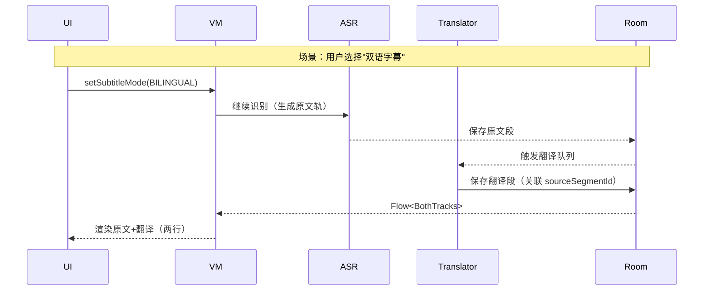
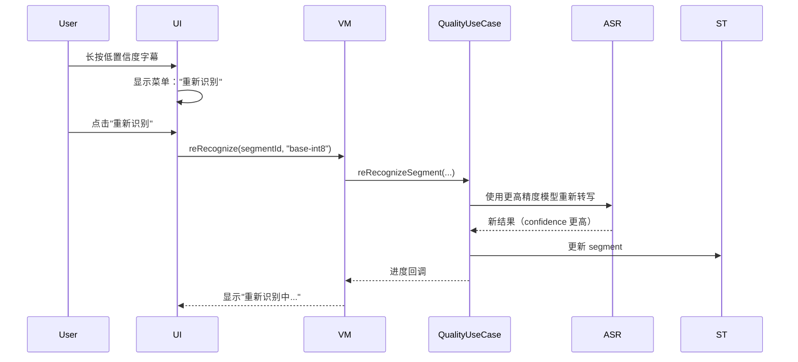

# Prism Player Android HLD v0.2 评审报告

> 评审日期：2025-10-25  
> 评审人：AI Architecture Reviewer  
> 文档版本：HLD v0.2 (2025-10-25)  
> 对标文档：PRD v0.2 (2025-10-17)

---

## 执行摘要

### 总体评价：✅ **良好 (Good)**

Android HLD v0.2 整体上与 PRD v0.2 保持了良好的对齐，技术选型合理，架构设计清晰。文档在技术可行性、性能指标、模块划分等方面展现了较高的完整度。

**关键优势：**
- ✅ 技术栈选择成熟且符合 Android 最佳实践（Jetpack Compose、Media3、Coroutines）
- ✅ MVVM + UseCase 架构分层清晰，利于测试和维护
- ✅ 性能指标与 PRD 完全对齐
- ✅ 翻译功能设计完整，包含离线优先策略
- ✅ 数据模型设计合理，Room 索引优化得当

**主要改进点：**
- ⚠️ 缺少翻译字幕数据模型的明确定义
- ⚠️ 双语字幕 UI 实现细节不足
- ⚠️ 质量感知（置信度标注、按段重识别）设计缺失
- ⚠️ 部分 PRD 要求（如简单评分）未覆盖
- ℹ️ 需补充更多边界场景处理细节

---

## 1. PRD 需求覆盖度分析

### 1.1 功能需求覆盖（FRD）

| PRD 章节 | 要求 | HLD 覆盖情况 | 评级 | 备注 |
|---------|------|------------|------|------|
| 6.1 媒体选择与播放 | 本地媒体、播放控制、倍速 | ✅ 完全覆盖 | 优秀 | Media3/ExoPlayer 完整支持 |
| 6.2 音频预加载与缓存 | 预加载窗口、LRU、内存压力响应 | ✅ 完全覆盖 | 良好 | 第 8 节详细说明了策略 |
| 6.3 模型管理与分发 | 下载/导入/校验/删除 | ✅ 完全覆盖 | 优秀 | SHA-256 校验、状态管理清晰 |
| 6.4 字幕生成与同步 | 时间同步、倍速适配、抢占识别 | ✅ 完全覆盖 | 优秀 | 唯一时钟源设计合理 |
| 6.5 字幕展示与样式 | 3 档字号、主题、背景 | ✅ 基本覆盖 | 良好 | Settings 包含 subtitleStyle，需细化 |
| 6.6 字幕导出 | SRT/VTT、UTF-8、命名规则 | ✅ 完全覆盖 | 优秀 | 第 6.5 节有明确说明 |
| 6.7 设置与偏好 | 模型/语言/预加载/缓存管理 | ✅ 完全覆盖 | 优秀 | Settings 实体设计合理 |
| 6.8 错误处理与状态 | 统一状态、错误分类、诊断导出 | ✅ 完全覆盖 | 良好 | 第 10、15 节覆盖 |
| 6.9 字幕质量感知 | 低置信度提示、重新识别、评分 | ⚠️ **部分缺失** | 待改进 | **缺少置信度标注 UI、按段重识别入口、评分机制** |
| 6.10 字幕翻译 | 离线翻译、双语模式、翻译轨导出 | ⚠️ 基本覆盖 | 良好 | **双语模式 UI 细节不足，数据模型未明确区分翻译轨** |

### 1.2 非功能需求覆盖（NFR）

| PRD 章节 | 要求 | HLD 覆盖情况 | 评级 |
|---------|------|------------|------|
| 7 - 性能与可用性 | KPI 分级、流畅渲染 | ✅ 完全覆盖 | 优秀 |
| 7 - 资源与能耗 | 缓存上限、节能策略 | ✅ 完全覆盖 | 优秀 |
| 7 - 隐私与合规 | 离线优先、显式同意 | ✅ 完全覆盖 | 优秀 |
| 7 - 稳定性 | 重试、幂等、可恢复 | ✅ 完全覆盖 | 良好 |
| 7 - 国际化（i18n） | 禁硬编码、中英双语 | ✅ 完全覆盖 | 优秀 |
| 7 - 可访问性（a11y） | 动态字体、TalkBack | ✅ 完全覆盖 | 良好 |
| 7 - 后台行为 | 持续识别、状态提示 | ✅ 完全覆盖 | 良好 |

### 1.3 用户故事验收标准（AC）覆盖

| 用户故事 | PRD AC | HLD 设计 | 覆盖度 |
|---------|--------|---------|--------|
| US1: 快速首帧字幕 | AC1: P95 达标; AC2: 失败提示 | ✅ 第 6.1 节序列图清晰 | 100% |
| US2: 滚动生成字幕 | AC1: 窗口优先; AC2: 占位替换 | ✅ 第 6.2 节窗口优先级 | 100% |
| US3: 拖动快速获得 | AC1: 抢占 60s; AC2: 占位状态 | ✅ 第 6.3 节抢占序列图 | 100% |
| US4: 调整字幕样式 | AC1: 3 档/主题/背景; AC2: 不影响播放 | ✅ Settings 实体设计 | 90% (样式细节可补充) |
| US5: 导出字幕文件 | AC1: SRT/VTT/UTF-8; AC2: 空间检查 | ✅ 第 6.5 节明确 | 100% |
| US6: 离线使用 | AC1: 离线识别; AC2: 最小权限 | ✅ 第 9、11 节 | 100% |
| US7: 后台继续识别 | AC1: 后台执行; AC2: 状态提示 | ✅ 第 8、18 节 | 100% |
| US8: 质量感知 | AC1: 低置信度标注; AC2: 重识别入口 | ⚠️ **缺失** | **0%** ⬅️ **关键缺陷** |
| US9: 翻译字幕 | AC1-4: 语言选择/同步/离线/导出 | ⚠️ 基本覆盖 | 70% (双语模式细节不足) |

---

## 2. 架构设计评审

### 2.1 总体架构 ✅

**优势：**
- MVVM + UseCase 分层清晰，符合 Android 最佳实践
- Flow 响应式设计利于实时字幕更新
- Mermaid 架构图直观易懂
- 模块职责边界明确（UI/Feature/Core/Data/Domain）

**建议：**
- 补充翻译模块（Translator）与 ASR 模块的协作时序图
- 明确 SubtitleOrchestrator 如何处理"原文轨"与"翻译轨"的切换逻辑

### 2.2 模块与包组织 ✅

**优势：**
- 包命名规范合理（`com.prism.player.*`）
- feature/core/data/domain 分层清晰
- 模块示例具体（如 `feature/asr`、`core/modelmgr`）

**建议：**
- 补充 `feature/translate` 包的详细职责说明
- 说明 `ui.translate` 与 `feature/translate` 的交互边界

### 2.3 数据模型设计 ⚠️

**优势：**
- Room 实体设计合理，索引优化得当
- 外键约束保证数据完整性
- WAL 模式 + VACUUM 策略清晰

**⚠️ 关键问题：翻译字幕数据模型缺失**

当前 `SubtitleSegment` 实体为：
```kotlin
id(PK), mediaId, startMs, endMs, text, confidence?
```

**问题：**
1. **未区分原文轨与翻译轨**：PRD 6.10 要求"导出可选择原文轨或翻译轨"，但当前模型无法区分
2. **无语言标识字段**：无法存储多语言字幕（如英文原文 + 中文翻译）
3. **翻译状态未建模**：无法标识"翻译中"、"翻译失败"等状态

**建议方案 A（推荐）：**
```kotlin
SubtitleSegment {
  id(PK),
  mediaId(FK),
  startMs, endMs,
  text,
  language: String,  // 'en', 'zh-Hans' 等
  trackType: TrackType, // ORIGINAL / TRANSLATED
  sourceSegmentId: String?, // 翻译轨指向原文轨
  confidence: Float?,
  translationStatus: TranslationStatus? // PENDING/DONE/FAILED (仅翻译轨)
}
```

**建议方案 B（轻量）：**
```kotlin
SubtitleSegment {
  ...现有字段...
  language: String,
  isTranslated: Boolean = false
}
```

**ER 图需更新：**
```mermaid
SUBTITLE_SEGMENTS {
  string id PK
  string mediaId FK
  long startMs
  long endMs
  string text
  string language       ← 新增
  string trackType      ← 新增
  string sourceSegmentId FK ← 新增（可选）
  float confidence
  string translationStatus ← 新增（可选）
}
```

### 2.4 关键流程设计 ✅ / ⚠️

#### 2.4.1 首帧字幕流程 ✅
- 序列图清晰完整
- 覆盖 PRD US1 的所有 AC

#### 2.4.2 翻译流程 ⚠️
**问题：**
1. **翻译轨与原文轨的关系未明确**：
   - 用户切换"字幕语言"为"翻译"时，原文轨是否保留？
   - 如何实现"双语模式"（原文+翻译同时显示）？

2. **翻译窗口调度策略不完整**：
   - 当前序列图仅展示"翻译当前窗口已出 ASR 段"
   - 未说明：
     - 如何处理"ASR 还在进行，翻译已可开始"的并发场景？
     - 翻译任务的优先级排序（抢占/当前窗口/预加载）如何与 ASR 协调？

**建议补充序列图：**


#### 2.4.3 双语字幕 UI 设计 ⚠️
**PRD 要求（6.10 UI）：**
> 双语模式（可选）以两行呈现（上原文/下翻译），避免遮挡内容

**HLD 缺失：**
- 未说明 SubtitleOverlay 如何布局两行文本
- 未说明如何确保"避免遮挡内容"（动态调整字号？半透明背景？）

**建议补充：**
```kotlin
// ui/player/SubtitleOverlay.kt 设计要点
@Composable
fun SubtitleOverlay(
  mode: SubtitleMode, // ORIGINAL / TRANSLATED / BILINGUAL
  segments: List<SubtitleSegment>,
  style: SubtitleStyle
) {
  when (mode) {
    BILINGUAL -> Column {
      Text(originalText, style.copy(fontSize *= 0.85)) // 略小以节省空间
      Text(translatedText, style.copy(fontSize *= 0.85))
    }
    // ...
  }
}
```

---

## 3. 质量感知功能缺失 ⚠️ **（高优先级）**

### 3.1 PRD 要求（6.9 + US8）

**PRD 6.9：字幕质量感知与用户反馈（增强）**
- 低置信度轻提示样式（不强打断）
- "重新识别（更高精度）"入口（按段），并提示耗时/电量开销
- 简单评分（1–5 星）可选，用于指导模型推荐（本地统计）

**US8 AC：**
- AC1：低置信度片段以弱提示样式标注（如颜色/透明度），不干扰观看
- AC2：为特定片段提供"重新识别（更高精度模型）"入口（可选）

### 3.2 HLD 现状

**数据模型中有 `confidence?` 字段**（第 5 节）：
```kotlin
SubtitleSegment: id, mediaId, startMs, endMs, text, confidence?
```

**但后续章节完全未涉及：**
- ❌ 无 UI 设计说明如何标注低置信度片段
- ❌ 无"按段重识别"的 UseCase 接口定义
- ❌ 无"简单评分"的数据模型与 UI 设计
- ❌ 第 14 节接口定义中未包含质量相关 API

### 3.3 改进建议

#### 3.3.1 补充数据模型
```kotlin
// 扩展 SubtitleSegment
SubtitleSegment {
  ...
  confidence: Float,       // 0.0-1.0
  isLowConfidence: Boolean // confidence < 0.6 时标记
}

// 新增实体（可选）
SubtitleRating {
  id(PK),
  segmentId(FK),
  rating: Int, // 1-5
  timestamp: Long
}
```

#### 3.3.2 补充 UseCase 接口（第 14 节）
```kotlin
interface QualityUseCase {
  // 按段重识别（使用更高精度模型）
  suspend fun reRecognizeSegment(
    segmentId: String,
    modelId: String, // 指定更高精度模型
    onProgress: (Float) -> Unit
  ): Result<SubtitleSegment>
  
  // 用户评分
  suspend fun rateSegment(segmentId: String, rating: Int)
  
  // 获取低置信度片段统计
  fun getLowConfidenceStats(mediaId: String): Flow<QualityStats>
}
```

#### 3.3.3 补充 UI 设计（第 3 节）
```kotlin
// SubtitleOverlay 样式变体
@Composable
fun SubtitleText(segment: SubtitleSegment, style: SubtitleStyle) {
  val alpha = if (segment.isLowConfidence) 0.7f else 1.0f
  Text(
    text = segment.text,
    color = style.color.copy(alpha = alpha),
    // 可选：低置信度时添加淡黄色边框
  )
}

// 长按字幕 → 弹出操作菜单
@Composable
fun SubtitleContextMenu(segment: SubtitleSegment) {
  if (segment.isLowConfidence) {
    MenuItem("重新识别（高精度）") { vm.reRecognize(segment) }
  }
  MenuItem("评分此字幕") { /* 1-5 星选择器 */ }
}
```

#### 3.3.4 补充流程图


---

## 4. 其他设计改进建议

### 4.1 音频预加载与缓存（第 8 节）

**当前设计：**
> 背压与节流：段间休眠与批量提交

**建议补充：**
- **内存压力响应的具体策略**（PRD 6.2 要求）：
  ```kotlin
  class AudioCacheManager {
    fun onTrimMemory(level: Int) {
      when (level) {
        TRIM_MEMORY_RUNNING_CRITICAL -> {
          // 保留"当前播放 ±15s"最小缓存
          evictExcept(currentPos - 15000, currentPos + 15000)
        }
        // ...
      }
    }
  }
  ```

- **LRU 淘汰策略的实现方式**：
  - 使用 `LruCache<TimeRange, ByteArray>` 或自定义队列？
  - 建议明确缓存 Key 设计（如 `"$mediaId:$startMs-$endMs"`）

### 4.2 模型管理（第 9 节）

**当前设计良好，小建议：**
- 补充"保留至少一个可用模型"的逻辑：
  ```kotlin
  suspend fun deleteModel(modelId: String): Result<Unit> {
    val activeModels = modelDao.getReadyModels()
    if (activeModels.size <= 1) {
      return Result.failure("至少保留一个可用模型")
    }
    // ...
  }
  ```

### 4.3 倍速播放适配（第 7 节）

**当前设计：**
> 字幕显示时长按播放速度等比缩放

**建议补充实现细节：**
```kotlin
// 第 7 节渲染策略补充
fun calculateDisplayDuration(
  segment: SubtitleSegment,
  playbackSpeed: Float
): Long {
  val baseDuration = segment.endMs - segment.startMs
  return (baseDuration / playbackSpeed).toLong()
}

// 当识别速度落后时的 UI 提示
if (rtf < playbackSpeed) {
  showToast("当前识别速度无法跟上播放速度，建议降低倍速或切换更快模型")
}
```

### 4.4 并发策略（第 8 节）

**当前设计良好，建议补充：**
- **翻译任务与 ASR 任务的调度优先级关系**：
  ```kotlin
  // 建议优先级：抢占 ASR > 抢占翻译 > 当前窗口 ASR > 当前窗口翻译 > 预加载
  enum class TaskPriority {
    PREEMPTIVE_ASR(100),
    PREEMPTIVE_TRANSLATE(90),
    CURRENT_WINDOW_ASR(70),
    CURRENT_WINDOW_TRANSLATE(60),
    PRELOAD_ASR(40),
    PRELOAD_TRANSLATE(30)
  }
  ```

### 4.5 错误处理（第 10 节）

**建议补充具体错误码映射：**
```kotlin
sealed class SubtitleError(val code: String, val userMessage: String) {
  object MediaUnsupported : SubtitleError("E001", "不支持的媒体格式")
  object StorageFull : SubtitleError("E002", "存储空间不足，请清理缓存")
  object ModelMissing : SubtitleError("E003", "未安装识别模型")
  object ModelCorrupted : SubtitleError("E004", "模型文件损坏，请重新下载")
  object PermissionDenied : SubtitleError("E005", "需要文件访问权限")
  object BackgroundRestricted : SubtitleError("E006", "后台处理受限")
  // 翻译相关
  object TranslationModelMissing : SubtitleError("E007", "未安装翻译模型")
  object UnsupportedLanguagePair : SubtitleError("E008", "不支持的语言对")
}
```

### 4.6 测试策略（第 16 节）

**建议补充测试场景：**
- **翻译功能测试**：
  - 单元测试：翻译轨与原文轨的关联正确性
  - 集成测试：双语模式下两轨同步性
  - UI 测试：双语字幕布局不遮挡内容

- **质量感知测试**：
  - 单元测试：低置信度片段标记逻辑
  - UI 测试：长按字幕菜单显示
  - 端到端测试：重识别流程完整性

---

## 5. 合规性与完整性检查

### 5.1 PRD Out of Scope 遵守情况 ✅

HLD 未引入以下内容（符合 PRD 范围）：
- ✅ 云端识别与账户系统
- ✅ 高级字幕编辑
- ✅ 说话人分离
- ✅ 视频烧录导出

### 5.2 里程碑对齐度 ✅

| PRD 里程碑 | HLD 里程碑 | 对齐度 |
|-----------|-----------|--------|
| M1: 原型（播放+ASR+SRT基础） | M1: 播放+NDK+分段转写+SRT | ✅ 100% |
| M2: 可用版（模型管理+翻译基础+VTT） | M2: 模型管理+翻译原型+Room+VTT | ✅ 95% (翻译细节需补充) |
| M3: 优化版（性能+a11y+质量感知） | M3: 性能优化+a11y+失败重试 | ⚠️ 80% (质量感知缺失) |

**建议：** M3 明确包含"质量感知功能"（低置信度标注 + 重识别 + 评分）

### 5.3 开放问题合理性 ✅

第 19 节开放问题设计合理：
- ✅ ABI 支持范围（影响包体）
- ✅ 翻译模型体积上限
- ✅ 离线批处理入口
- ✅ KPI 校准样机

**建议补充：**
- 双语字幕的默认布局策略（两行 vs. 切换显示）
- 翻译轨与原文轨的存储策略（同表 vs. 分表）

---

## 6. 关键缺陷与风险汇总

### 6.1 P0（必须修复）

| 缺陷 ID | 描述 | 影响范围 | 建议修复方案 |
|--------|------|---------|------------|
| **D001** | **翻译字幕数据模型未区分原文轨与翻译轨** | PRD 6.10, US9 AC4 | 新增 `language`、`trackType`、`sourceSegmentId` 字段 |
| **D002** | **质量感知功能（US8）完全缺失** | PRD 6.9, US8 全部 AC | 补充置信度标注 UI、重识别 UseCase、评分机制 |

### 6.2 P1（建议修复）

| 缺陷 ID | 描述 | 影响范围 | 建议修复方案 |
|--------|------|---------|------------|
| **D003** | 双语字幕 UI 设计细节不足 | PRD 6.10 UI 要求 | 补充 SubtitleOverlay 双行布局设计 |
| **D004** | 翻译任务与 ASR 任务的调度优先级未明确 | PRD 6.10 调度要求 | 补充 TaskPriority 枚举与调度策略 |
| **D005** | 内存压力响应策略实现细节缺失 | PRD 6.2 内存压力响应 | 补充 `onTrimMemory` 实现代码示例 |

### 6.3 P2（可选优化）

- 补充 LRU 缓存 Key 设计细节
- 补充错误码映射表
- 补充翻译功能测试场景

---

## 7. 最终建议

### 7.1 必须完成（M2 前）

1. **修复 D001**：重新设计 `SubtitleSegment` 实体以支持多语言轨道
2. **修复 D002**：补充质量感知功能设计（置信度标注 + 重识别 + 评分）
3. **修复 D003**：补充双语字幕 UI 实现细节

### 7.2 建议完成（M2 后）

1. 补充翻译与 ASR 的调度协调序列图
2. 补充内存压力响应的代码示例
3. 补充翻译功能测试场景

### 7.3 架构演进建议（M3+）

1. **考虑引入 StateFlow/SharedFlow 优化字幕更新性能**：
   - 当前 Flow 可能在高频更新时产生背压
   - 建议评估 `StateFlow` 用于"当前显示字幕"状态管理

2. **考虑字幕缓存持久化策略**：
   - 当前设计未明确：用户关闭应用后，已识别字幕是否保留？
   - 建议补充：Room 中 `SubtitleSegment` 的生命周期管理策略

3. **考虑模型热切换能力**：
   - 用户在播放中切换模型（如从 tiny 升级到 base）
   - 建议补充：模型切换时的状态迁移与缓存清理策略

---

## 8. 评审总结

### 8.1 强项

1. **技术选型成熟**：Jetpack Compose、Media3、Coroutines 均为行业最佳实践
2. **架构设计清晰**：MVVM + UseCase 分层合理，易于测试和维护
3. **性能指标对齐**：与 PRD KPI 完全一致
4. **数据模型优化**：Room 索引设计合理，WAL 模式优化得当
5. **文档质量高**：Mermaid 图表清晰，技术细节完整

### 8.2 改进空间

1. **翻译功能细节不足**：双语模式 UI、数据模型区分、调度策略需补充
2. **质量感知功能缺失**：置信度标注、重识别、评分机制完全未设计
3. **边界场景处理不足**：内存压力响应、模型热切换等需补充实现细节

### 8.3 最终评级

| 维度 | 评分 | 权重 | 加权分 |
|-----|------|------|--------|
| PRD 功能覆盖度 | 85/100 | 30% | 25.5 |
| 架构设计合理性 | 90/100 | 25% | 22.5 |
| 技术可行性 | 95/100 | 20% | 19.0 |
| 文档完整性 | 80/100 | 15% | 12.0 |
| 风险识别与缓解 | 85/100 | 10% | 8.5 |
| **总分** | **87.5/100** | - | **87.5** |

**评级：B+（良好）**

---

## 9. 下一步行动计划

### 9.1 立即行动（本周内）

- [ ] HLD 作者审阅本评审报告
- [ ] 确认 D001（翻译数据模型）修复方案
- [ ] 确认 D002（质量感知功能）设计方案

### 9.2 短期行动（2 周内）

- [ ] 更新 HLD v0.3 版本，修复 P0 和 P1 缺陷
- [ ] 补充双语字幕 UI 设计细节
- [ ] 补充翻译与 ASR 调度协调设计

### 9.3 中期行动（M2 迭代）

- [ ] 实现翻译功能（含双语模式）
- [ ] 实现质量感知功能（置信度标注 + 重识别）
- [ ] 编写对应单元测试和集成测试

---

**评审完成日期：** 2025-10-25  
**评审人签名：** AI Architecture Reviewer  
**下次评审建议时间：** HLD v0.3 发布后（预计 2025-11-01）
