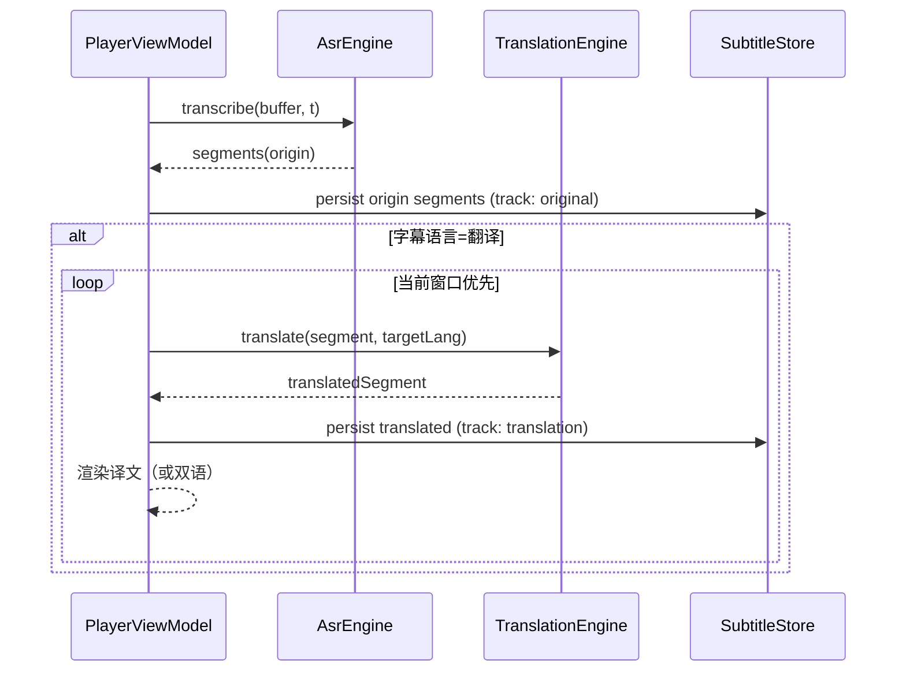
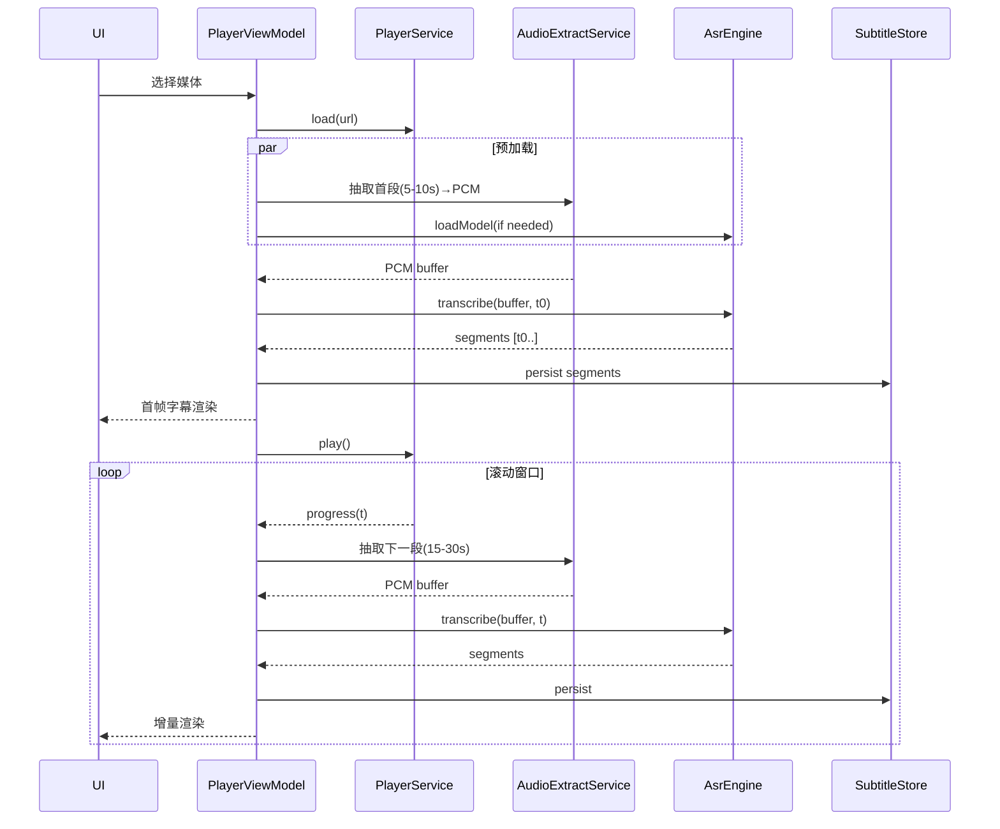

# Prism Player 高级架构设计（HLD）— iOS + macOS

> 版本：v0.2（对应 PRD v0.2 / TFA v0.2）  
> 日期：2025-10-17  
> 适用平台：iOS（iPhone/iPad）与 macOS（含 Apple Silicon 与 Intel，优先 Apple Silicon）  
> 设计定位：定义端侧离线字幕播放器的整体架构与关键技术方案；不含具体代码实现。

## 0. 目标与范围

- 产品目标（摘自 PRD）：
  - 本地媒体播放 + 端侧 ASR（离线）→ 生成带时间戳字幕，边播边出字；
  - 可选字幕翻译（离线优先，首批英→中），与播放同步展示与导出；
  - 字幕呈现（样式、开关）与导出（SRT 必选，VTT 选）；
  - 模型管理（下载/导入/删除）、语言选择、缓存与设置；
  - i18n/a11y 与隐私合规（默认离线）。
- 平台补充：iOS 与 macOS 同时支持；优先共享核心逻辑与引擎绑定，分别接入平台特性（文件访问、后台策略、UI 习惯）。
- 非目标（首期 Out of Scope，见 PRD）：云端识别、账户系统、高级字幕编辑、说话人分离、字幕烧录导出。

## 1. 成功标准与 KPI 对齐

- 首帧字幕可见时间（P95）：高端 ≤ 5s；中端 ≤ 8s；入门 ≤ 12s（必要时降级提示）。
- 时间同步偏差 ≤ ±200ms（以播放器当前时间为唯一时钟源）。
- 端侧处理率 RTF：高端 ≥ 1.0；中端 ≥ 0.5；入门 ≥ 0.3。
- 稳定性：播放中字幕连续可见；导出成功率 ≥ 99%。
- 翻译延迟：自 ASR 段产生到译文段渲染的耗时 P95 ≤ 2s（基础版目标）。

技术手段：
- 预加载 30s 音频（可配 10/30/60s），首帧优先采用 5–10s 极速窗口并行抽取与推理；
- 小模型优先（tiny/base 量化），流式/滑窗推理与双缓冲流水线；
- 抢占式调度（seek 后 60s 窗口优先），LRU 缓存与内存压力响应。

## 2. 总体架构

- 架构风格：多平台 SwiftUI + MVVM + 服务模块化；ASR 引擎采用“可插拔后端”设计：
  - whisper.cpp（C/C++，gguf，Metal/Accelerate）
  - MLX Swift 后端（基于 mlx-swift，加载兼容的 ASR 模型；优先 Apple Silicon）
  通过统一 Swift 协议提供一致 API，并在运行时/设置中选择后端。
- 工程分层：
  - UI 层（SwiftUI，iOS/macOS 自适配）
  - ViewModel 层（状态、意图、调度）
  - Domain/UseCase 层（播放控制、识别编排、抢占/节流、导出）
  - Service 层（播放器、音频抽取、ASR、字幕存储、模型/缓存、导出、指标）
  - 引擎与系统桥接层（C/C++ + Swift 封装，AVFoundation/BackgroundTasks/macOS Power APIs）

### 2.1 组件模块

- PlayerService（AVFoundation 封装）
  - 职责：播放/暂停、倍速、拖动、进度回调、时钟源；
  - 实现：AVPlayer（iOS/macOS 通用），提供统一时间基准（CMTime）。
- AudioExtractService（音频抽取/转码）
  - 职责：从媒体滚动提取音频段，转为 16kHz/mono/16bit PCM；
  - 实现：AVAssetReader + AVAudioConverter（或 AVAudioEngine Tap）；滑窗与段长（15–30s）。
- AsrEngine（端侧 ASR 引擎，协议 + 多后端）
  - 职责：加载模型、分段/流式推理、语言选择、取消与进度；统一返回带时间戳的 Segment。
  - 后端实现：
    - WhisperCppBackend：基于 whisper.cpp（gguf，Metal 优先，Accelerate/NEON 兜底）。
    - MLXSwiftBackend：基于 mlx-swift（参考 mlx-swift-examples），用于加载兼容的 ASR 模型。
  - 选择策略：
    - 默认 WhisperCppBackend（成熟、跨 iOS/macOS）；
    - 当用户选择 MLX 兼容模型且设备支持（Apple Silicon 优先）时启用 MLXSwiftBackend；
    - 若模型不含可靠时间戳输出，则需启用 VAD/对齐模块（见开放问题）。
- SubtitleStore（字幕存储与索引）
  - 职责：按窗口/片段（start/end/text/confidence）增量持久化；
  - 实现：SQLite（轻量），窗口索引 + 片段表；长视频只保留必要内存态。
- ModelManager（模型管理）
  - 职责：下载/导入/删除、校验（SHA256）、版本与语言元数据、空间检查；
  - 实现：URLSession（iOS 支持后台下载），文件校验与原子移动，String Catalog 文案提示。
- CacheManager（LRU 缓存）
  - 职责：音频片段与中间产物缓存（≤10MB），内存警告响应；
  - 实现：基于文件缓存 + SQLite 索引；LRU 淘汰；收到内存警告仅保留“当前播放 ±15s”。
- ExportService（SRT/VTT 导出）
  - 职责：汇总片段（支持选择原文轨或译文轨），格式化时间戳、UTF-8 编码、空间检查、文件命名与分享；
  - 实现：SRT 必选、VTT 可选；<源文件名>.<locale>.srt；双语导出（可选，后续版本）。
- MetricsService（离线指标与诊断）
  - 职责：首帧时间、段耗时、失败率、模型选择分布；诊断包（配置/设备/时序日志，脱敏）。
 - TranslationEngine（翻译引擎，协议 + 多后端）
  - 职责：将 ASR 原文片段翻译为目标语言；支持取消与批量；返回与原片段对齐的译文文本。
  - 后端（候选）：
    - 本地 NMT（如 Marian/NLLB 的精简/量化版）经 Swift 封装（MLX 优先在 macOS）。
    - 量化小型通用 LLM 翻译（实验，受体积与质量约束）。
  - 路径：默认离线；当本地不支持所选语对时，提示下载对应模型；（可选）用户显式同意后可启用联网文本翻译后端（仅上传转写文本）。

### 2.2 并发与调度

- Swift Concurrency 为主（actor/Task/AsyncSequence），保证线程安全与取消传播；
- JobScheduler：
  - 队列：预加载、滚动识别、抢占识别三类；
  - 优先级：抢占（seek）> 当前播放窗口滚动 > 预加载；
  - 公平性：避免长视频单一队列饿死；
  - 取消：进度跳转/模型切换时取消过期任务，回收资源；
  - 背压：受限设备/后台时降速与合并段请求。

## 3. 跨平台策略（iOS vs macOS）

- UI：统一 SwiftUI 代码，针对平台差异使用 #if os(iOS)/#if os(macOS) 做细节分支（导航/窗口行为）。
- 文件访问：
  - iOS：UIDocumentPicker、文件权限说明（Info.plist）；
  - macOS：NSOpenPanel + 安全范围书签（Sandbox 有效），拖拽支持；
- 后台：
  - iOS：Audio 背景模式允许播放中持续识别；非播放用 BGProcessingTask 批量识别；beginBackgroundTask 做短时收尾；
  - macOS：默认可后台运行；使用 NSProcessInfo.beginActivity 防 App Nap；遵循能耗策略；
- 下载：
  - iOS：URLSession background configuration，断点续传与系统托管；
  - macOS：URLSession 默认足够，必要时同背景下载配置；
- 加速：
  - Apple Silicon：Metal（whisper.cpp ggml-metal）；MLX Swift（macOS 优先支持，iOS 支持以官方进展为准）。
  - Intel macOS：Accelerate/BLAS（whisper.cpp）；MLX Swift 受限（建议使用 WhisperCppBackend）。

## 4. 数据模型与存储

### 4.1 领域模型（Swift 类型示意）

- Segment：{ id, mediaId, trackId, startMs, endMs, text, confidence [0..1], lang, originSegmentId?, createdAt }
- WindowIndex：{ id, mediaId, rangeStartMs, rangeEndMs, status (pending/running/done/failed), lastTriedAt }
- ModelMetadata：{ id, displayName, langSet, sizeBytes, quantization, sha256, version, installedAt }
- SubtitleTrack：{ id, mediaId, kind (original|translation), lang, displayName }
- TranslationJob：{ id, mediaId, originSegmentId, targetLang, status, lastError? }
- Settings：{ subtitleOn, fontScale (small/medium/large), theme (light/dark/auto), bgOpacity, preloadSec (10/30/60), asrLang (auto|code), subtitleLang (original|code), lastAsrModelId, lastTransModelId }
- Metrics（局部匿名）：{ key, value, ts }；Logs（诊断按需收集）。

### 4.2 存储与路径

- SQLite（GRDB/原生 SQLite）：
  - 表：segments、windows、models、settings、metrics；
  - 迁移：schemaVersion 管理，应用升级自动迁移；
- 文件系统：
  - 模型：Application Support/Models/<modelId>/model.gguf（或拆分）；
  - 音频缓存：Caches/Audio/<mediaId>/<startMs-endMs>.pcm；
  - 导出：用户选择目录（建议 Documents/PrismExports）。

## 5. 播放-抽取-识别-渲染流水线

- 时间基准：以 AVPlayer 当前时间（CMTime）为唯一时钟源；字幕渲染容差 ±200ms。
- 预加载：
  - 选择媒体后并行：模型加载/热身 + 解析媒体轨道 + 抽取 Tpre（默认 30s，首帧优先 5–10s）。
- 滚动识别：
  - 按 15–30s 段滚动抽取与推理，增量落盘，并驱动 UI 渲染；
  - 倍速播放：显示时长与速度等比缩放；识别落后时弱提示建议降速/换模型。
- 拖动抢占：
  - 暂停当前渲染→定位新时间→立即展示已识别片段→未识别区域显示占位；
  - 调度优先识别“当前点起后 60s（可调）”，取消过期任务。
- 失败重试与降级：
  - 段失败标记可重试；连续失败触发降级策略（缩小窗口/更小模型）。

### 5.2 翻译流水线（原文→译文）

- 触发：ASR 产出原文 Segment 后，由 ViewModel/UseCase 将片段送入 TranslationEngine 队列；
- 优先级：与识别相同的窗口策略（抢占 > 当前窗口滚动 > 预加载），保障“看得懂”；
- 存储：译文作为独立 `SubtitleTrack(kind: .translation, lang: target)` 下的 Segment，`originSegmentId` 关联原文；
- 渲染：当目标语言被选择时，优先查询译文轨；缺失片段显示“翻译中…”；双语模式下按两行显示；
- 失败与重试：记录错误并支持按段重试；连续失败可提醒更改模型或切换为原文轨。



### 5.1 时序（Mermaid）



## 6. ASR 引擎集成（whisper.cpp 优先）

本节扩展为“双后端 ASR 方案”：WhisperCppBackend 与 MLXSwiftBackend。

### 6.1 统一接口（Swift 协议）

```swift
public protocol AsrEngine {
    func loadModel(at url: URL, metadata: ModelMetadata, options: AsrOptions) throws
    func setLanguage(_ language: AsrLanguage) async
    func transcribe(samples: UnsafeBufferPointer<Int16>, sampleRate: Int,
                    startMs: Int64, options: AsrOptions) async throws -> [Segment]
    func resetContext() async
    func cancelAll() async
}

public struct AsrOptions {
    public var temperature: Float
    public var beamSize: Int
    public var vadEnabled: Bool
    public var prompt: String?
}

public enum AsrLanguage { case auto, code(String) }
```

### 6.2 WhisperCppBackend

- 理由：移动端成熟、Metal 加速、C/C++ 易桥接、许可宽松（MIT）。
- 构建与集成：
  - 以 Swift Package `PrismASR` 的 C/C++ target 集成 whisper.cpp 源码；
  - iOS/macOS 共用源码，`#define` 切换 ggml-metal 或 Accelerate；
  - Swift 封装对接统一协议；
  - 模型：gguf（tiny/tiny.en/base/base.en），量化（q5/int8）。

### 6.3 MLXSwiftBackend（mlx-swift）

- 理由：利用 MLX Swift 在 Apple Silicon 上的高效推理与灵活模型加载能力；
- 兼容性：
  - macOS（Apple Silicon）优先；
  - iOS 支持需关注 MLX Swift 的官方进展与体积/许可限制；
- 模型：参考 `mlx-swift-examples` 可加载的 ASR 模型（需具备时间戳或可通过 VAD/强制对齐生成）；
- 集成：
  - Swift Package `PrismASRMLX`（纯 Swift 依赖 MLX Swift）；
  - 提供与 `AsrEngine` 一致的实现，必要时在 `AsrOptions` 中启用 VAD；
  - 时间戳路径：
    - 原生模型具备时间戳 → 直接输出 Segment；
    - 不具备 → 采用短窗（10–15s）+ VAD 切段 + 简易对齐/能量峰值启停（精度见风险）。

### 6.4 模型元数据扩展

在 `ModelMetadata` 中新增：

- `backend: AsrBackend`（`.whisperCpp` | `.mlxSwift`）
- `supportsTimestamps: Bool`（模型是否原生输出时间戳）
- `arch: String`（如 whisper, conformer 等，便于展示）

### 6.5 选择与回退策略

- 用户在设置中选择默认后端与模型；
- 当所选后端不可用（平台/加速不可用或包缺失）→ 回退至 WhisperCppBackend（若可用）；
- 当 MLX 模型不支持时间戳 → 启用 VAD/短窗策略并对 UI 提示“时间同步精度可能降低”，或引导选择支持时间戳的模型；
- 进程内允许切换后端：切换时取消在途任务并重建上下文。

### 6.6 构建与打包

- Swift Packages：
  - `PrismASR`（whisper.cpp）
  - `PrismASRMLX`（mlx-swift）
- iOS 体积与许可控制：
  - 默认仅集成 `PrismASR`；当开启实验性 MLX 支持时以条件编译（Feature Flag 或独立构建配置）引入 `PrismASRMLX`；
- macOS 构建：默认同时包含两个后端，Apple Silicon 优先启用 MLX。

### 6.7 指标与调优

- 记录不同后端的 RTF、首帧时间、失败率；
- 在相同设备上对比相同段的耗时与能耗，指导默认推荐；
- 为 MLX 后端维护一组推荐参数（窗长、温度、VAD 阈值）。

### 6.8 风险与对策（后端相关）

- MLX Swift 在 iOS 的落地与包体：可能受限 → 以 macOS 优先，iOS 作为可选实验；
- 非时间戳模型的对齐精度：需要 VAD + 简易对齐，可能影响 ±200ms 指标 → UI 弱提示并建议选择支持时间戳的模型或回退 WhisperCpp；
- 维护成本：双后端代码与测试矩阵扩大 → 用统一协议、契约测试与金样本音频回归降低成本。

### 6.9 翻译引擎（概述）

```swift
public protocol TranslationEngine {
  func loadModel(at url: URL, metadata: ModelMetadata, options: TranslationOptions) throws
  func translate(text: String, sourceLang: String, targetLang: String) async throws -> String
  func translateBatch(_ items: [(id: String, text: String, sourceLang: String, targetLang: String)]) async throws -> [String: String]
  func cancelAll() async
}

public struct TranslationOptions {
  public var temperature: Float
  public var beamSize: Int
}
```

- 时序：译文生成不影响 ASR 主路径；
- 资源：低端设备建议批量/合并句子以降低开销；
- 兼容：当 ASR 支持直接翻译模式（且目标语可用）时，可绕过 TranslationEngine，直接以 ASR 输出作为译文轨。

## 7. 内存与缓存策略

- 音频缓存：≤ 10MB，总量 LRU；优先保留“当前播放 ±15s”；
- 引擎上下文：分段推理后及时释放中间张量；长视频禁止全量内存驻留；
- 内存警告（iOS）：收到警告立即降级清理；
- 能耗：后台/低电量降速；热管理（必要时暂停或切小窗口）。

## 8. 错误处理与状态反馈

- 统一状态：waiting/running/success/failure；UI 轻提示不遮挡内容；
- 错误分类：
  - 媒体不支持（不含音轨/解码失败）；
  - 空间不足（模型/导出/缓存）；
  - 模型缺失/损坏（校验失败/不兼容）；
  - 权限拒绝（文件访问/后台限制）；
  - 后台受限（iOS 任务被挂起）。
- 重试与幂等：下载/校验/导出具备重试；识别段失败可重试；
- 诊断包：配置、设备与版本、关键时序、错误码（脱敏，不含媒体）。

## 9. i18n 与 a11y

- i18n：
  - 禁用硬编码字符串；统一使用 String Catalog（.xcstrings），首期 zh-Hans/en-US；
  - 日期/数字/方向性依系统区域；
- 可访问性（a11y）：
  - 动态字体、对比度达标；屏幕阅读器可读控件与状态；
  - “朗读字幕”与原音频冲突，提供显式开关且默认关闭。

## 10. 背景与系统行为

- iOS：
  - 开启 Audio 背景模式，播放中允许持续识别；
  - 非播放态使用 BGProcessingTask 触发批量识别（非实时）；
  - beginBackgroundTask 用于短时收尾（数分钟）；
- macOS：
  - 使用 NSProcessInfo.beginActivity(options: .userInitiatedAllowingIdleSystemSleep) 在识别期间抑制 App Nap；
  - 任务完成及时结束 activity；用户可在设置中允许/禁止长任务抑制睡眠。

## 11. UI 与 ViewModel 合同（概要）

- PlayerView（共用）：
  - 输入：media URL、subtitle style、isSubtitleOn；
  - 输出：进度、可见字幕列表、加载占位；
- PlayerViewModel：
  - 方法：load(media), play(), pause(), seek(to:), setSpeed(x), toggleSubtitles(), setStyle(...)
  - 状态：currentTime, bufferedWindows, currentSegments, status（统一状态机），warnings（性能/落后提示）。
- ModelManagerView：展示与操作模型列表（下载/导入/删除/默认选择）。
- SettingsView：预加载时长、语言选择、缓存清理、字幕样式。
  - 新增：字幕语言（原文/翻译〈目标语言选择〉/双语 可选），默认跟随上次选择；当目标语对未安装翻译模型时，提供下载入口与体积提示。

## 12. 导出（SRT/VTT）

- 命名：<源文件名>.<language/locale>.srt，避免覆盖；支持选择导出原文轨或译文轨；
- 格式：UTF-8，无 BOM；时间戳 00:00:00,000 → 00:00:02,000；
- 空间检查：导出前评估可用空间；失败可重试；
- macOS 支持保存面板；iOS 使用分享面板/文件保存。

## 13. 构建与工程组织

- Xcode 多平台工程 + Swift Package 组件化：
  - apps/PrismPlayer-iOS（iOS 目标，SwiftUI）
  - apps/PrismPlayer-macOS（macOS 目标，SwiftUI）
  - packages/PrismCore（纯 Swift：ViewModels、UseCases、Services 接口与默认实现）
  - packages/PrismASR（C/C++：whisper.cpp + Swift 封装）
  - packages/PrismKit（工具：SQLite 访问层、缓存、导出格式化、Metrics）
- 依赖与规范：
  - SwiftLint（严格模式）
  - String Catalogs（本地化）
  - 单元测试：Core/Kit 层可测试；对 ASR 使用金样本短音频回归；
  - 持续集成（后续）：多平台构建矩阵（iOS 17+/macOS 14+）。

## 14. 安全与隐私

- 默认离线工作，不上传媒体/字幕内容；
- 本地清理：缓存与模型一键清理；
- 许可披露：第三方依赖与模型来源、版本与条款在“关于”页展示；
- 文件权限说明：Info.plist（iOS）/Sandbox 配置（macOS）。

## 15. 风险与缓解（与 TFA 对齐）

- 性能不足（低端设备）：默认小模型、限窗、节流与占位提示，建议降速/换模型；
- 背景限制（iOS）：播放中可行；非播放改为任务化；
- 存储压力：下载前体积提示与空间检查；一键清理；至少一个可用模型保留；
- 语言检测误差：允许手动指定并持久化；
- 热与能耗：段间节流、后台降速；
- 许可合规：模型哈希校验，来源可信；不内置大模型。
- 翻译质量与体积：首批限定语对与小模型；必要时提示联网翻译（仅上传转写文本，需显式同意）；提供回退到原文字幕。

## 16. 开放问题（进入详细 TDD/HLD 迭代）

- 双引擎可能性评估（whisper.cpp vs CT2/faster-whisper）与切换成本；
- Metal 与 Core ML 路线收益对比（Core ML 需转换与体积评估）；
- 抢占调度默认参数（窗口长度、合并策略、失败重试退避策略）；
- 置信度阈值与断句合并默认参数，是否暴露为高级设置；
- 数据迁移方案细化（schema version 与回滚）。

---

附：质量门（本设计文档）
- Build：PASS（文档，不涉及编译）
- Lint/Typecheck：PASS（文档）
- Tests：PASS（文档）
